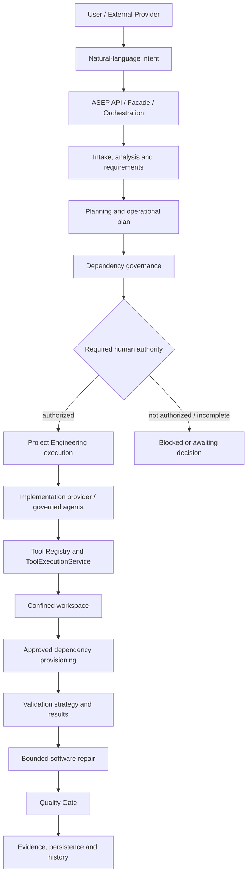

# ASEP — Project Context & Engineering Memory

| Campo | Valor |
|---|---|
| Projeto | ASEP — AI Software Engineering Platform |
| Repositório | `C:\Users\paulo.trajano\Documents\ai-software-house` |
| Branch de trabalho | `feature/phase-10-business-engineering` |
| Último checkpoint | 2026-09-02 |
| Finalidade | Memória estrutural, arquitetural e operacional para continuidade entre pessoas, sessões, modelos e provedores |
| Autoridade | Estado verificável do repositório e do runtime; decisões humanas e ADRs nos respectivos escopos |
| Regra de atualização | Atualizar quando uma decisão, arquitetura, sprint, gate, risco ou procedimento durável mudar; não sobrescrever fatos históricos silenciosamente |

> **Princípio de fonte da verdade**
>
> **DOCUMENTAÇÃO É CONTEXTO. O ESTADO EXECUTÁVEL É A FONTE FINAL DA VERDADE.**

As etiquetas usadas neste documento têm significado estrito:

- **[IMPLEMENTADO]** existe em código ou configuração verificável;
- **[VALIDADO]** possui evidência verificável de teste, execução ou inspeção;
- **[DECIDIDO]** foi aprovado pela autoridade competente;
- **[PLANEJADO]** possui intenção ou escopo registrado, mas não prova implementação;
- **[FUTURO]** é direção possível, ainda não contratada como capacidade atual;
- **[BLOQUEADO]** não deve avançar até que a condição indicada seja resolvida;
- **[NÃO AUTORIZADO]** exigiria autorização ainda não concedida;
- **[ATENÇÃO]** indica risco, ressalva ou limitação de evidência;
- **[HISTÓRICO]** preserva um estado ou interpretação anterior.

# 1. Executive Context

O ASEP é uma **AI Software Engineering Platform**: uma plataforma para governar
o ciclo de engenharia de software realizado com assistência ou execução de IA.
Seu objetivo não é somente gerar código. Ele organiza intenção, requisitos,
planejamento, arquitetura, autoridade, dependências, implementação, efeitos em
ferramentas, validação, reparo, Quality Gates, evidências e histórico.

O princípio de produto é:

> **SIMPLES POR FORA. RIGOROSO POR DENTRO.**

O usuário deve expressar o resultado desejado de maneira natural. A plataforma
deve converter essa intenção em trabalho governado, rastreável e verificável,
sem esconder riscos nem transformar conveniência em bypass.

# 2. Product Vision

A experiência desejada é orientada por comandos como:

```text
Crie...
Modifique...
Corrija...
Continue...
Pare...
Explique...
```

O usuário comum não precisa dominar `Operational Plan`, `DeveloperAgent`,
`Dependency Plan`, `Validation Strategy`, `Repair` ou `Quality Gate` para pedir
uma mudança. Esses mecanismos continuam ativos internamente e ficam disponíveis
por **progressive disclosure**: resumo e decisão primeiro; planos, evidências e
diagnósticos quando necessários para avaliar risco ou intervir.

# 3. Product Philosophy

| Invariante | Consequência operacional |
|---|---|
| Natural-language-first | A entrada principal descreve intenção e resultado, não a mecânica interna. |
| Governance-first | Uma capacidade técnica não implica autoridade para usá-la. |
| Evidence-driven | Sucesso exige evidência; declarações do agente não substituem validação. |
| Fail-closed | Ausência, inconsistência ou falha em controle crítico bloqueia o avanço. |
| Explicit authority | Aprovação, execução, dependência e risco material têm autoridade identificável. |
| Reproducibility | Versões, comandos, planos e fingerprints devem permitir reconstrução. |
| Auditability | Estado, decisões, efeitos, gates e erros preservam rastreabilidade. |
| Controlled side effects | Escrita e subprocessos atravessam ferramentas e fronteiras governadas. |
| No silent bypass | Validators, gates, ADRs e dependency governance não são contornados informalmente. |
| Human authority at consequential gates | Publicação, execução autorizada, risco alto e decisões arquiteturais permanecem humanos quando exigido. |

# 4. Architecture Overview

O mapa abaixo representa as fronteiras verificadas no repositório. Nem toda
execução atravessa todas as etapas, mas efeitos e decisões devem permanecer em
seus limites próprios.



**[IMPLEMENTADO]** O repositório contém fachadas/pipelines, Orchestrators,
Project Engineering, providers, agentes, Registry, Tools, validação, repair,
Quality Gates e persistência. Os contratos não devem ser confundidos: por
exemplo, `ProjectExecution`, execução sequencial e `Run` são identidades
distintas, conforme o ADR-033.

# 5. Engineering Pipeline

| Estágio | Função | Estado/efeito esperado |
|---|---|---|
| Intake | Capturar objetivo, público, restrições e autoridade | Entrada validada ou perguntas/bloqueio |
| Analysis / requirements | Construir contexto e critérios verificáveis | Fatos, hipóteses e requisitos rastreáveis |
| Planning / architecture | Definir abordagem, fronteiras e decisões | Plano e ADR quando necessário |
| Preparation | Analisar workspace e persistir planos preparatórios | `ProjectExecution` tipicamente `pending`; nenhum direito de execução |
| Dependency planning | Combinar baseline, manifests e decisões históricas | Plano estruturado, exact versions e blockers explícitos |
| Authorization | Confirmar autoridade para a transição consequencial | Aprovação explícita ou espera/bloqueio |
| Execution | Consumir uma preparação elegível uma única vez | Mudanças confinadas e histórico persistido |
| Implementation | Produzir mudanças pelo provider/agente autorizado | Changes e step results auditáveis |
| Provisioning | Materializar somente plano integralmente aprovado | Evidence ou falha fechada antes dos validators |
| Validation | Construir strategy, executar validators allowlisted | Resultados estruturados e evidence |
| Repair | Analisar falha e tentar correção limitada | Nova validação; não é retry operacional |
| Quality Gate | Avaliar critérios sobre evidências | Aprovação ou bloqueio registrado |
| Evidence / history | Preservar planos, decisões, mudanças e resultados | Retomada e auditoria reproduzíveis |

> **[ATENÇÃO] PREPARED/PENDING != AUTHORIZED TO EXECUTE.**
>
> Uma preparation pode conter análise, operational plan e dependency plan sem
> conceder autorização para implementação, provisioning ou validation.

# 6. Authority Model

O contrato operacional em [AGENTS.md](../AGENTS.md) limita autoridade e exige
escalonamento diante de conflito, risco alto, evidência insuficiente ou mudança
irreversível. Em especial:

- criar uma preparation requer escopo/autorização compatível;
- aprovar preparation ou iniciar execution é transição separada;
- versão de nova dependência externa exige dependency decision autorizada;
- execution authorization não é inferida de plano, pacote, workspace ou código;
- Quality Gate deve resultar de critérios e evidências, não de autodeclaração;
- mudança arquitetural relevante ou reversão de ADR exige decisão explícita;
- publicação, gasto, segredo, exclusão material, main e risco alto exigem a
  autoridade humana aplicável.

Planos são propostas governadas. Packages são entradas. Workspaces são alvos.
Nenhum desses objetos é autorização.

# 7. Dependency Governance

**[IMPLEMENTADO]** Project Engineering constrói um `DependencyPlan` usando
baseline, análise dos manifests e decisões históricas. A governança contempla:

- versões exatas; ranges `latest`, caret e tilde não fazem parte do contrato;
- reutilização de decisões aprovadas compatíveis com projeto, package, versão e registry;
- prevenção de requests pendentes duplicados;
- `manifest_group` explícito para `dependencies`, `devDependencies` ou `optionalDependencies`;
- distinção entre package interno do workspace e package externo;
- validação de todos os manifests relevantes do monorepo;
- materialização apenas de plano integralmente aprovado;
- `npm install --package-lock-only --save-exact` e depois `npm ci`, ambos com scripts/audit/fund desabilitados;
- cache npm confinado e reutilização somente com evidence/fingerprints compatíveis;
- bloqueio antes dos validators diante de pacote extra, versão divergente, grupo conflitante ou provisioning falho;
- evidence de provisioning sem conteúdo de arquivos.

A decisão canônica está em
[ADR-034 — Provisioning controlado de dependências aprovadas](../docs/adr/ADR-034-controlled-approved-dependency-provisioning.md).

**[PLANEJADO]** Argon2id é requisito técnico da Sprint 2. Nenhum package externo
Argon2 foi selecionado. Se for necessário, deverá entrar pelo fluxo normal de
dependency governance; não pode ser inferido ou instalado automaticamente.

# 8. Tool Governance

Os ADRs
[ADR-023](../docs/adr/ADR-023-tool-registry.md) e
[ADR-031](../docs/adr/ADR-031-controlled-software-generation.md) preservam a
separação entre raciocínio e efeitos. Agentes não recebem poder irrestrito sobre
filesystem, processos ou dependências. Efeitos são mediados por Registry,
`ToolExecutionService`, resolução confinada de workspace e contratos explícitos.

Tools devem validar input, limitar paths, sanitizar dados sensíveis, produzir
resultado/evidence e falhar de maneira estruturada. Tool failure observável é
parte do resultado de engenharia; não deve desaparecer como erro genérico do
provider.

# 9. Validation Architecture

`ProjectExecution.validation_strategy` é, por modelo, opcional:

```python
validation_strategy: ProjectValidationStrategy | None = None
```

**[IMPLEMENTADO]** Durante completion da execution, depois da captura de changes
e do provisioning aprovado, `ProjectEngineeringExecutionService` solicita uma
strategy ao validation service quando existe `operational_plan`. A strategy é
persistida na mesma `ProjectExecution` antes da execução dos validators. Quando
o builder/runner estruturado não está disponível, o fluxo usa `_validate_strategy`
como fallback legado.

Os conceitos são distintos:

| Conceito | Papel |
|---|---|
| Validation strategy | Seleção estruturada de validators, razão e target hints |
| Validation results | Comando, exit code, status, output limitado e sequência |
| Repair | Análise/correção limitada após falha funcional; separado de retry operacional |
| Quality Gate | Decisão sobre critérios e conjunto de evidências |

> **[ATENÇÃO]** `validation_strategy = null` **durante preparation** não constitui
> sozinho um blocker. A cobertura real ainda deve ser comprovada no ciclo de
> execution/validation e avaliada pelo Quality Gate.

# 10. Quality Gate

Quality Gate é a fronteira de decisão que converte resultados verificáveis em
aprovação ou bloqueio. Ele permanece separado do provider, agente e repair. O
registro estruturado não elimina artefatos de auditoria; a política documentada
é audit-first.

**[VALIDADO]** A execution homologada da Sprint 1 terminou `succeeded` com
Quality Gate `APPROVED`.

**[NÃO AUTORIZADO]** A Sprint 2 não possui validation results nem Quality Gate;
nada neste documento a declara aprovada ou pronta para execução.

# 11. Persistence and Evidence

O armazenamento operacional atual preserva, conforme aplicável:

- `ProjectExecution`, status, timestamps e identidade;
- `operational_plan` e `preparation_analysis`;
- fingerprints de workspace/contexto;
- `dependency_requests` e `dependency_plan`;
- changes e step results;
- validation strategy, validation results e failure analyses;
- repair e Quality Gate;
- provisioning evidence com fingerprints;
- `error_code`, `error_detail`, blocker e next action;
- memória/contexto limitado, usage e histórico de lifecycle.

**[ATENÇÃO]** O banco operacional é fonte executável; documentação não autoriza
escrita direta em SQLite. A consulta deve ocorrer preferencialmente pelas APIs
governadas. A auditoria de 2026-09-02 usou SQLite `mode=ro` apenas porque a API
estava parada.

# 12. Repository Map

| Caminho | Responsabilidade principal |
|---|---|
| `src/asep/` | Implementação da plataforma e contratos públicos |
| `tests/` | Testes unitários, integração, arquitetura, API e aceitação |
| `core/` | Contratos organizacionais, qualidade, comunicação e escalonamento |
| `runtime/` | Regras de carregamento e operação do runtime |
| `templates/` | Templates de artefatos e handoff |
| `projects/` | Projetos, decisões e registros específicos |
| `docs/` | Arquitetura, ADRs, fases, auditorias e releases |
| `registry/` | Catálogos declarativos de capacidades e gates |
| `workflows/` | Definições e procedimentos de workflow |
| `deployment/` | Artefatos de implantação |
| `storage/` | Dados locais gerados; não é documentação versionada de produto |
| `.context/` | Memória estrutural e checkpoint operacional do repositório |

# 13. Existing Documentation Ecosystem

Estes documentos continuam normativos ou especializados:

- [AGENTS.md](../AGENTS.md): autoridade e contrato operacional;
- [runtime/context-loading.md](../runtime/context-loading.md): carregamento de contexto;
- [templates/handoff.md](../templates/handoff.md): template genérico de handoff;
- [templates/documentation/handover.md](../templates/documentation/handover.md): handover documental;
- [core/COMMUNICATION.md](../core/COMMUNICATION.md): conteúdo mínimo de comunicação;
- [core/ESCALATION.md](../core/ESCALATION.md): gatilhos e roteamento de escalonamento.

Este `PROJECT_CONTEXT` consolida memória durável. O
[AI_HANDOFF](AI_HANDOFF.md) captura o checkpoint operacional atual. Eles
complementam, mas não substituem regras locais, contratos de agentes ou ADRs.

# 14. TaskFlow

TaskFlow é o projeto E2E usado para provar que ASEP consegue governar trabalho
real sobre um workspace externo.

| Campo | Valor |
|---|---|
| Project name | `TaskFlow Beta Test` |
| Project ID | `9be00568-4026-4929-8abb-9933581c31bd` |
| Workspace | `C:\Users\paulo.trajano\ASEP-Beta\workspaces\legacy-local\9be00568-4026-4929-8abb-9933581c31bd\workspace` |
| Operational storage | `C:\Users\paulo.trajano\ASEP-Beta\data` |

Esses caminhos são específicos do ambiente Windows auditado e devem ser
redescobertos em outra máquina. O estado persistido não deve ser copiado ou
editado manualmente para simular uma transição.

# 15. TaskFlow Baseline

**[VALIDADO]** O workspace contém monorepo npm com:

- `apps/web` — Next.js/React;
- `apps/api` — NestJS/Fastify;
- `apps/worker` — worker com BullMQ;
- `packages/config` — package interno `@taskflow/config@0.1.0`;
- `prisma/` e `prisma.config.ts`;
- `package-lock.json`, exact versions e `node_modules` materializado.

O schema Prisma atual já possui `User`, `Task`, enums `TaskStatus` e
`TaskPriority`, relação de ownership e índices. Ele **não** possui ainda o
modelo organizacional e de autenticação requerido pela Sprint 2.

> **[ATENÇÃO]** `Task` já existe no baseline, mas funcionalidades de tasks
> permanecem fora do escopo da Sprint 2. Presença no schema não autoriza
> antecipar Sprints 3–9.

# 16. Sprint History

| Sprint/fase | Objetivo | Estado | Execution/Preparation | Quality Gate | Observação |
|---|---|---|---|---|---|
| Fase 0 | Baseline funcional, arquitetura e plano incremental | **[VALIDADO] PASS** | `8c511f9c-5968-4b63-9085-40080e9283e2` | Fase 0 PASS | Fonte histórica do baseline |
| Sprint 1 | Fundação técnica | **[VALIDADO] CONCLUÍDA** | `fe0acdc7-210a-4631-8c16-1968563f0e4e` | `APPROVED` | Autorização consumida |
| Sprint 2 | Banco, organizations, autenticação e usuários | **[NÃO AUTORIZADO] PREPARED/PENDING** | `ac47bfaf-b2b2-4772-b5ec-9f943535557f` | Ausente | Não executada |

# 17. Sprint 1

**[VALIDADO]** A Sprint 1 está concluída, sua execução E2E foi homologada e o
Quality Gate final foi `APPROVED`. O registro canônico é
[sprint-1-closure.md](../projects/taskflow/reports/sprint-1-closure.md).

Execution: `fe0acdc7-210a-4631-8c16-1968563f0e4e`.

Os principais problemas e correções foram importantes porque transformaram
governança declarada em comportamento aplicável:

| Área | Problema / correção | Por que importou |
|---|---|---|
| Provider auto-wiring | Provider de implementação foi ligado à composição Codex | Evitou que execução real caísse silenciosamente em caminho apenas determinístico. |
| Workspace propagation | Workspace correto passou por decomposição, contexto e provider | Impediu análise/alteração fora do projeto alvo. |
| Decision reuse | Decisões aprovadas passaram a ser reutilizadas com identidade compatível | Evitou repetir aprovação sem abrir brecha para versão diferente. |
| Duplicate request prevention | Request pendente equivalente deixou de ser recriado | Preservou trilha decisória coerente. |
| `error_detail` | Falhas passaram a preservar detalhe limitado e seguro | Tornou diagnóstico possível sem depender de logs externos. |
| No-op | No-op verificável ganhou evidence própria | Evitou confundir ausência legítima de mudança com execução defeituosa. |
| Dependency context | Plano aprovado passou a chegar ao provider/agente | Impediu inferência informal de packages/versões. |
| Tool failure observability | Falha de tool passou a permanecer estruturada | Evitou sucesso falso ou erro opaco. |
| `.env.example` security | Exemplo e contexto passaram a respeitar allowlist/sanitização | Reduziu risco de segredo em prompt, log ou artefato. |
| Monorepo validation | Descoberta passou a considerar múltiplos package roots | Validators deixaram de olhar apenas o manifest raiz. |
| Approved provisioning | Dependência aprovada ausente passou a poder ser materializada de modo controlado | Aprovação tornou-se executável sem liberar instalação arbitrária. |
| Exact versions / npm cache | Instalação ficou reprodutível e confinada | Reduziu drift e custo sem sacrificar governança. |
| Snapshot boundaries | `node_modules` e artefatos efêmeros deixaram de contaminar changes | Preservou diff de produto e idempotência. |
| `manifest_group` | Grupo do manifest passou a fazer parte do contrato | Evitou mover dependência entre runtime e desenvolvimento silenciosamente. |
| TypeScript `rootDir` | Configuração de API/worker foi corrigida pelo fluxo normal | Resolveu TS6059 preservando fronteiras do monorepo e gerando evidence. |
| Quality Gate | Typechecks API/worker passaram e gate final aprovou | Fechou a Sprint com prova, não apenas com mudança aplicada. |

# 18. Sprint 1 Lessons Learned

- Preparation é análise persistida; execution é uma transição separada.
- Dependência aprovada não significa dependência materializada no workspace.
- Evidence e fingerprints são necessários para reutilizar provisioning com segurança.
- Snapshots precisam distinguir código de produto de `node_modules`, caches e runtime artifacts.
- Providers e agentes precisam receber workspace, dependency plan e contexto explicitamente.
- Tool failures e erros de aplicação precisam carregar detalhes seguros e estruturados.
- Monorepos exigem descoberta real dos package roots e de seus manifests.
- No-op precisa ser comprovado; “nenhuma mudança” não é automaticamente sucesso.
- Governança que não alcança o caminho de execução real é apenas documentação.
- Quality Gate deve permanecer depois de provisioning e validation, nunca ser inferido do output da IA.

# 19. Sprint 2

## Banco, organizations, autenticação e usuários

Objetivo: criar a base de identidade, isolamento organizacional e acesso seguro.

### Functional Scope — [PLANEJADO]

- organização inicial;
- login, logout e logout-all;
- sessões opacas e revogáveis;
- convite e ativação;
- definição e recuperação de senha;
- usuários e perfil;
- desativação/reativação;
- papéis `ADMIN` e `MEMBER`.

### Technical Scope — [PLANEJADO]

- Prisma/PostgreSQL;
- identidade global e memberships organizacionais;
- contexto derivado de sessão e isolamento por `organizationId`;
- Argon2id;
- tokens persistidos somente como hash, com expiração e single use;
- autorização no backend;
- frontend dos fluxos de acesso;
- interface de e-mail e fake para testes, sem serviço externo real.

### Explicitly Out of Scope

Projetos, tasks, workflow, comentários, notificações funcionais, dashboards,
busca, Kanban, produção, funcionalidades das Sprints 3–9, jobs funcionais da
Sprint 6 e provedor real de e-mail.

# 20. Sprint 2 Current State

Preparation: `ac47bfaf-b2b2-4772-b5ec-9f943535557f`.

| Campo | Estado persistido em 2026-09-02 |
|---|---|
| Status | `pending` |
| Operational plan | present |
| Preparation analysis | present |
| Dependency plan | 23 entries, todas `approved` |
| Error code / blocker / next action | `null` |
| Validation strategy | `null` |
| Validations | absent |
| Step results | absent |
| Sprint 2 provisioning | absent |
| Repair | absent |
| Quality Gate | absent |

**[NÃO AUTORIZADO]** A Sprint 2 não foi executada. O operational plan é um plano
determinístico persistido, não prova que seus steps foram realizados.

# 21. Sprint 2 Readiness Interpretation

**[VALIDADO]** Auditoria de código, testes e persistência confirmou que a
ausência de `validation_strategy` durante preparation é válida. A strategy é
construída no ciclo posterior de execution/validation.

Consequências:

- não criar correção artificial para preencher o campo durante preparation;
- não tratar `null` isoladamente como blocker;
- não inferir readiness apenas porque esse falso blocker foi removido;
- verificar coverage, targets, validators e Quality Gate no estágio apropriado;
- exigir decisão humana antes de approval/execution.

# 22. Sprint 2 Validation Expectations

**[PLANEJADO]** A eventual execução deverá produzir evidência adequada para:

- unit tests;
- integração PostgreSQL;
- E2E de autenticação;
- login válido/inválido, logout e logout-all;
- invite/activation e password recovery;
- revogação imediata de sessão;
- autorização `ADMIN`/`MEMBER`;
- isolamento negativo com duas organizações;
- bootstrap idempotente e concorrente;
- token expirado, reutilizado e replay;
- ausência de tokens, hashes e senhas em logs;
- schema Prisma e migrations controladas;
- typecheck dos targets afetados;
- Next build quando houver frontend;
- Quality Gate final.

Nenhum desses critérios está declarado como implementado ou validado para a
Sprint 2 neste checkpoint.

# 23. ADR-014 — TaskFlow Bootstrap

A decisão aplicável é
[projects/taskflow/decisions/ADR-014-bootstrap-initial-credentials.md](../projects/taskflow/decisions/ADR-014-bootstrap-initial-credentials.md).

**[DECIDIDO]** O bootstrap usa convite/token de ativação de uso único, e não
senha inicial gerada ou distribuída por secret. O token deve ser
criptograficamente seguro, persistido somente como hash, expirar, ser consumido
atomicamente uma vez, nunca aparecer em logs e permitir que o próprio usuário
defina a senha. Bootstrap e isolamento organizacional permanecem idempotentes.

Rationale: eliminar distribuição de senha bootstrap, reduzir exposição de
credencial e tornar ativação auditável e revogável.

**[ATENÇÃO]** Existe outro ADR-014 em
`projects/asep-self-development/decisions/ADR-014-sequential-execution-tailoring.md`.
Nunca referenciar “ADR-014” sem caminho ou escopo.

# 24. Relevant Platform ADRs

| ADR | Tema verificado | Impacto / invariante |
|---|---|---|
| [ADR-015](../docs/architecture/decisions/ADR-015-provider-boundaries-and-execution-graph-isolation.md) | Fronteiras de providers e Execution Graph | Provider não orquestra workflow, gate, persistência ou exporters. |
| [ADR-022](../docs/adr/ADR-022-intelligent-agent-runtime.md) | Runtime separado para agentes inteligentes | Registry resolve; runtime governa lifecycle; Engine não conhece agentes. |
| [ADR-023](../docs/adr/ADR-023-tool-registry.md) | Tool Registry | Tools são explícitas, mediadas e governadas. |
| [ADR-025](../docs/adr/ADR-025-planning-engine.md) | Planning Engine | Planejamento precede execução consequencial. |
| [ADR-028](../docs/adr/ADR-028-end-to-end-pipeline.md) | Fachada e pipeline E2E | Consumidor não precisa compor subsistemas manualmente. |
| [ADR-030](../docs/adr/ADR-030-intelligent-orchestrator-boundary.md) | Intelligent Orchestrator | Coordena serviços; não incorpora suas lógicas internas. |
| [ADR-031](../docs/adr/ADR-031-controlled-software-generation.md) | Geração mediada por Tools | Agentes não escrevem livremente no filesystem. |
| [ADR-032](../docs/adr/ADR-032-software-repair-boundary.md) | Repair separado de recovery | Corrigir conteúdo não é repetir operação. |
| [ADR-033](../docs/adr/ADR-033-sequential-quality-boundary.md) | Identidade e persistência de qualidade | Agregados não são unidos por coincidência de ID; quality evidence é persistida. |
| [ADR-034](../docs/adr/ADR-034-controlled-approved-dependency-provisioning.md) | Provisioning aprovado | Apenas exact versions integralmente aprovadas podem ser materializadas. |

# 25. Decisions That Must Not Be Silently Reversed

- agentes mediados por Tools governadas;
- planejamento antes de execução consequencial;
- provisioning somente de dependency plan aprovado;
- fail-closed em ausência ou inconsistência de controles;
- repair separado de execution recovery;
- Quality Gate sustentado por evidence;
- bootstrap TaskFlow por one-time activation token;
- ausência de senha bootstrap em plaintext;
- `validation_strategy` criada no ciclo de execution/validation, não forçada na preparation;
- separação entre packages internos e dependências externas;
- exact versions, auditabilidade e confinamento de workspace.

Reversão material exige autoridade explícita e ADR compatível quando afetar
arquitetura ou risco.

# 26. Dependency Baseline

| Package | Versão | Grupo confirmado |
|---|---:|---|
| `@nestjs/common` | `11.2.3` | dependencies |
| `@nestjs/core` | `11.2.3` | dependencies |
| `@nestjs/platform-fastify` | `11.2.3` | dependencies |
| `@prisma/client` | `7.10.0` | dependencies |
| `bullmq` | `6.3.1` | dependencies |
| `fastify` | `5.12.1` | dependencies |
| `next` | `16.3.3` | dependencies |
| `react` | `19.2.8` | dependencies |
| `react-dom` | `19.2.8` | dependencies |
| `prisma` | `7.10.0` | devDependencies |
| `typescript` | `5.9.3` | devDependencies |
| `@types/node` | `24.13.3` | devDependencies |
| `@taskflow/config` | `0.1.0` | package interno do workspace |

As 23 entradas da preparation combinam baseline e ocorrências descobertas em
manifests. Elas não equivalem a 23 packages externos distintos. Packages
transitivos do lockfile também não se tornam automaticamente aprovados para uso direto.

# 27. Security Invariants

### Plataforma — [IMPLEMENTADO]/[DECIDIDO]

- fail-closed em dependency provisioning e validações críticas;
- sem instalação arbitrária, `latest`, scripts npm ou registry não autorizado;
- workspace confinado e Tools mediadas;
- filtragem de chaves sensíveis em memória, logs e resultados;
- ambiente de provider deve usar allowlist, não herdar secrets indiscriminadamente;
- decisões, errors e evidence persistidos com dados limitados.

### Sprint 2 — [PLANEJADO]

- tokens one-time persistidos somente como hash;
- single use, expiração e consumo atômico;
- senha definida pelo usuário;
- nenhum token/senha/hash em logs;
- isolamento por organização derivado da sessão;
- autorização no backend por membership ativa e papel;
- desativação revoga acesso/sessões;
- bootstrap idempotente e seguro sob concorrência.

# 28. Technical Incidents

## Incidente A — prefixo acidental em `developer.py`

- Origem: commit `bd81cc5`.
- Sintoma: primeira linha começava com `Get-Content git-core-diff.txt` antes da docstring.
- Impacto: módulo Python sintaticamente inválido; API não podia compor/importar corretamente.
- Fix: `ce6d086` removeu somente o prefixo acidental.
- Decisão: não reverter `bd81cc5` inteiro porque o commit contém correções legítimas de provisioning e governança.

## Incidente B — artefatos temporários Pytest rastreados

- Árvores: `.pytest-tmp-sprint91-cov`, `.pytest-tmp-sprint91-full` e `.pytest-tmp-sprint91-focused`.
- Quantidade: 4.062 arquivos.
- Introdução histórica: `f6ed7a1328acf32b0b4d0f530e91005725111e0b`.
- Problema adicional: ACL Windows impedia listagem/leitura e fazia Git reportar exclusões aparentes.
- Recuperação operacional histórica: ownership/permissões foram recuperados com `takeown`/`icacls`.
- Cleanup Git: `3d0f331` deixou de rastrear os artefatos; `.pytest-tmp-*/` permanece ignorado.
- Invariante: output temporário de teste não é produto nem evidence canônica por padrão.

# 29. Known Environment Risks

No checkpoint, `git status` está limpo, mas emite `Permission denied` ao tentar
enumerar diretórios ignorados:

- `.pytest-codex-dependency-reuse/`;
- `.pytest-retomada-focused/`;
- `test-output/dependency-reuse/`.

**[ATENÇÃO]** Isso é risco operacional/limpeza futura, não prova corrupção do
índice. Não executar restore/reset/clean ou alterar ACL sem diagnóstico e
autorização específicos.

# 30. Known Documentation Debt

- **[HISTÓRICO/SUPERSEDED]** O readiness da Sprint 2 interpretou
  `validation_strategy = null` na preparation como blocker. A revisão de
  2026-09-02 corrige essa interpretação sem apagar o histórico.
- O README do TaskFlow anteriormente não indexava readiness e ADR de bootstrap.
- O schema Prisma foi descrito como “apenas estrutural”; na realidade já contém
  `User` e `Task`, embora não contenha o domínio organizacional da Sprint 2.
- Há dois ADRs numerados 014 em escopos diferentes.
- A branch local coincide com a ref local de origin, mas não tem upstream e não
  houve `fetch`; “sincronizada com remoto” não está plenamente validado.

# 31. Git Workflow

1. Executar `git status --short --branch` antes de mudar qualquer coisa.
2. Confirmar branch, HEAD e escopo autorizado.
3. Revisar `git diff -- <arquivo>` antes de stage.
4. Fazer stage específico; evitar `git add .` em árvore misturada.
5. Revisar `git diff --cached` e `git diff --cached --check` antes de commit.
6. Lembrar: commit não é push; push não é merge.
7. Não alterar ou fazer merge em `main` sem autorização.
8. Não limpar/restaurar mudanças desconhecidas pertencentes a outra pessoa/agente.

# 32. API / Local Runtime

Comando documentado:

```powershell
python -m uvicorn asep.api.composition:create_default_app --factory --host 127.0.0.1 --port 8000
```

Health:

```text
GET http://127.0.0.1:8000/api/v1/health
```

**[VALIDADO]** A API funcionou após a correção de `developer.py` em checkpoint
anterior. **[ATENÇÃO]** Ela estava parada em 2026-09-02. Runtime não persiste
como fato entre sessões; verificar processos e health novamente.

# 33. Current Checkpoint

| Campo | Estado auditado |
|---|---|
| Data | 2026-09-02 |
| Branch | `feature/phase-10-business-engineering` |
| HEAD | `ce6d08608067b37a07b1330b3ce3048f2abaeb34` |
| Working tree | clean antes deste draft documental |
| Origin local ref | coincide com HEAD |
| Upstream | não configurado |
| Fetch de rede | não executado |
| API | parada; nenhum listener em 8000 |
| Sprint 2 | prepared/pending; não autorizada; não executada |

# 34. Exact Next Operational Sequence

1. Confirmar Git, branch, HEAD e working tree.
2. Verificar processos/runtime; não assumir que a API continua ativa.
3. Iniciar a API somente com autorização operacional.
4. Confirmar `GET /api/v1/health`.
5. Consultar em read-only a preparation da Sprint 2.
6. Comparar API/persistência com este handoff.
7. Revisar dependency plan, operational plan, blocker e next action.
8. Reavaliar readiness e cobertura de validação.
9. Somente com decisão humana considerar approval/execution.

# 35. Future Architecture

## Visual UX baseline — 2026-09-02

Os itens abaixo são **[BUG/UX OBSERVADO]** no primeiro teste visual governado da
própria ASEP. Eles formam o baseline inicial de usabilidade; não representam
score, solução implementada ou mudança automática do escopo da Sprint 2.

| ID | Achado observado | Impacto para o usuário |
|---|---|---|
| UX-01 | “Reconstruindo sessão” pode permanecer indefinidamente quando a hydration falha, sem diagnóstico ou alternativa visível. | O usuário não distingue espera normal, falha de frontend e indisponibilidade da API. |
| UX-02 | Um login aceito seguido de perda ou rejeição da sessão pode retornar ao AccessGate sem feedback. | A interface aparenta ignorar credenciais válidas e não informa a ação segura seguinte. |
| UX-03 | Estados e metadados internos, como `pending`, IDs, targets e validators, são expostos diretamente. | Vocabulário de implementação substitui significado e consequência para o usuário. |
| UX-04 | “Fase atual: Testes” pode ser confundida com o estado da Sprint 2, embora a preparation esteja `pending` e ainda não executada. | Lifecycle do projeto e lifecycle da execution parecem uma única coisa. |
| UX-05 | “Continuar a fase atual” não explica claramente o que acontecerá. | Ação, efeito, risco e responsável ficam implícitos. |
| UX-06 | “Sessões” ocupa papel excessivamente central para um conceito técnico. | O usuário precisa compreender mecanismo interno antes de expressar sua intenção. |
| UX-07 | Existe entrada em linguagem natural, mas ela permanece subordinada a sessões, modos e runtime e usa linguagem vinculada ao Codex. | A experiência parece operar uma ferramenta/provider, não conversar com a ASEP. |

Categorias preparadas para futuras comparações do benchmark:

- Natural Language Experience;
- Discoverability;
- Clarity;
- Time to First Useful Result;
- Human Intervention;
- Technical Vocabulary Exposure;
- Error Recovery;
- Visual Product Testing;
- Governance;
- Traceability;
- Provider Flexibility;
- Cost/Usage Control.

**[REFERÊNCIA COMPETITIVA]** Hercules é referência de simplicidade e experiência
para o benchmark, não arquitetura a ser copiada. Nenhum score foi atribuído.

## Natural Language First — [DIREÇÃO DE PRODUTO / NÃO IMPLEMENTADO]

Qualquer operação que possa ser expressa naturalmente pelo usuário deve poder
ser iniciada em linguagem natural. As abas existem para oferecer visibilidade,
exploração e controle; elas não devem obrigar o usuário a compreender a
arquitetura interna antes de obter valor.

Direções associadas:

- Chat ASEP como centro de comando;
- progressive disclosure;
- organizar a experiência por “Onde estou / O que aconteceu / O que posso
  fazer agora”;
- traduzir estados internos para linguagem humana;
- oferecer ações orientadas a resultado, com efeito e consequência claros;
- tratar sessões como mecanismo interno ou histórico;
- manter detalhes técnicos disponíveis em uma camada avançada;
- impedir que um provider defina a identidade visual ou conversacional da ASEP.

Exemplo conceitual:

- evitar: “O que você quer que o Codex faça?”;
- preferir: “O que você quer que a ASEP faça?”.

## Organization & Identity — [FUTURO / NÃO IMPLEMENTADO]

- o criador/contratante pode tornar-se `OWNER` da organização;
- `OWNER` é distinto de `ADMIN` e controla configurações comerciais e sensíveis;
- `ADMIN` permanece papel operacional;
- `MEMBER` permanece papel de uso.

`OWNER` comercial não existe no modelo atual e exige decisão de produto,
autorização, threat model, migration e validação próprias antes de implementação.

## ASEP MCP — [FUTURO]

Pode expor capacidades governadas do ASEP a agentes/provedores externos. Não
deve expor acesso direto a SQLite, arbitrary writes, desativação de validators,
override de Quality Gate ou instalação arbitrária de packages.

## Provider Hub — [FUTURO]

Pode centralizar providers, credenciais/autenticação, models, routing, fallback,
usage e budgets. A ASEP deve permanecer provider-agnostic: Codex é um provider,
não a identidade da IA da ASEP. Adapters devem ser intercambiáveis e uma futura
política pode selecionar providers por custo, capacidade, privacidade e
disponibilidade. Multi-provider e Provider Hub **não estão implementados**.

### BYOK — [FUTURO / NÃO IMPLEMENTADO]

- o cliente pode conectar sua própria credencial de provider;
- o consumo ocorre na conta/token do próprio cliente;
- secrets nunca aparecem em prompts, logs ou evidências;
- armazenamento deve ser seguro e criptografado;
- rotação, revogação e validação da conexão são obrigatórias.

### ASEP Managed AI — [POSSIBILIDADE COMERCIAL / NÃO IMPLEMENTADO]

O cliente pode futuramente optar por créditos ou IA fornecidos pela própria
ASEP, em coexistência com BYOK. Essa oferta não existe atualmente e depende de
política comercial, segurança, billing, limites e evidência operacional.

### AI Usage & Budget — [DIREÇÃO FUTURA]

A governança futura deve permitir consumo por organização, usuário, projeto,
execution, provider e model; input/output tokens; custo estimado; budgets;
alertas; limites; e comportamento fail-closed quando a política exigir. A
plataforma já possui partes de usage/quota, mas isso não comprova a experiência
comercial completa aqui descrita.

Qualquer desenho deve preservar classificação de dados, auditabilidade,
governança de custos e as fronteiras de provider existentes.

## Provider versus governance — [PRINCÍPIO]

Trocar o provider não altera a governança da ASEP. O pipeline conceitual
permanece:

```text
User Intent
→ Planning
→ Architecture
→ Dependency Governance
→ AI Runtime / Provider
→ Governed Tools
→ Validation
→ Repair
→ Quality Gate
→ Evidence
```

O provider gera ou propõe. A ASEP governa.

# 36. Protocolo de retomada por outro provedor

1. Ler este `PROJECT_CONTEXT` integralmente.
2. Ler [AI_HANDOFF.md](AI_HANDOFF.md).
3. Ler [AGENTS.md](../AGENTS.md).
4. Descobrir regras locais aplicáveis ao caminho/tarefa.
5. Executar `git status --short --branch`.
6. Confirmar branch.
7. Confirmar HEAD e refs locais/remotas disponíveis.
8. Inspecionar o working tree sem limpar/restaurar mudanças.
9. Verificar processos e runtime.
10. Verificar health da API, se ela estiver autorizada/ativa.
11. Consultar estado persistido e preparation/execution somente por leitura.
12. Comparar estado real com o handoff.
13. Relatar divergências classificando fato, hipótese, decisão e pergunta.
14. Propor a próxima ação segura.
15. Aguardar autoridade humana em qualquer gate aplicável.

> **NUNCA continuar mecanicamente do próximo item do handoff sem validar o
> estado real.**

# 37. Stop Conditions

Parar e pedir decisão humana diante de:

- branch divergente ou HEAD inesperado;
- working tree desconhecidamente suja;
- preparation/execution em estado diferente do checkpoint;
- nova dependência externa ou versão ainda não decidida;
- migration destrutiva ou risco de perda de dados;
- alteração/supersessão de ADR;
- pedido de bypass de validator, Tool governance ou Quality Gate;
- segredo, token ou credencial detectado em input/output/log;
- mudança arquitetural material;
- Quality Gate inconsistente com evidências;
- publicação, merge em main ou operação destrutiva sem autoridade.

Aplicar [core/ESCALATION.md](../core/ESCALATION.md) e registrar fato, impacto,
ações seguras, alternativas, autoridade necessária e condição de retomada.

# 38. Glossary

| Termo | Definição operacional |
|---|---|
| ASEP | Plataforma governada para engenharia de software executada com assistência de IA. |
| TaskFlow | Projeto E2E externo usado para provar capacidades reais do ASEP. |
| Preparation | Análise e planos persistidos antes da autorização de execução. |
| Execution | Instância que consome autorização e pode produzir efeitos governados. |
| Operational Plan | Sequência estruturada de inspeção, implementação e validação. |
| Dependency Plan | Packages, versões, fontes, grupos e status que governam provisioning. |
| Dependency Decision | Decisão humana persistida sobre package/versão/registry. |
| Validation Strategy | Validators e targets estruturados para uma execution. |
| Validation | Execução de verificação allowlisted com resultado persistido. |
| Provisioning | Materialização controlada de dependências integralmente aprovadas. |
| Repair | Correção limitada de software após falha funcional; não é retry operacional. |
| Quality Gate | Decisão sobre critérios baseada em evidências. |
| Evidence | Registro verificável de plano, efeito, comando, fingerprint ou resultado. |
| Provider | Adaptador de implementação/IA atrás de contrato neutro. |
| Agent | Executor especializado governado por contrato e contexto. |
| Tool | Capacidade explícita para efeito ou consulta. |
| Registry | Catálogo e resolução de capacidades declaradas. |
| Fail-closed | Bloquear quando um controle necessário não pode ser comprovado. |
| ADR | Registro de decisão arquitetural com contexto e consequências. |
| Workspace | Raiz confinada sobre a qual uma execution autorizada pode operar. |

# 39. References

- [README principal](../README.md)
- [AGENTS.md](../AGENTS.md)
- [Architecture Map](../docs/architecture/ArchitectureMap.md)
- [ASEP Architecture v1](../docs/architecture/ASEP-Architecture-v1.md)
- [Roadmap](../docs/architecture/Roadmap.md)
- [Project Engineering operational projections](../docs/phase-23/operational-projections.md)
- [TaskFlow README](../projects/taskflow/README.md)
- [Sprint 1 closure](../projects/taskflow/reports/sprint-1-closure.md)
- [Sprint 2 readiness](../projects/taskflow/reports/sprint-2-readiness.md)
- [TaskFlow bootstrap ADR](../projects/taskflow/decisions/ADR-014-bootstrap-initial-credentials.md)
- [ADR-034](../docs/adr/ADR-034-controlled-approved-dependency-provisioning.md)
- [Communication protocol](../core/COMMUNICATION.md)
- [Escalation protocol](../core/ESCALATION.md)
- [AI operational handoff](AI_HANDOFF.md)
