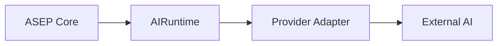

# AI Runtime provider-agnostic

**Dono:** Engenharia ASEP | **Versão:** 0.4 | **Status:** vigente

## Objetivo

`asep.ai_runtime` define a porta para geração externa ou local sem expor
SDK, transporte, payload ou identidade fechada de fornecedor ao Core.

`AIRuntimeRequest` representa intenção, contexto JSON e metadados. O resultado
normaliza output, identidade extensível, consumo opcional e metadados. A
identidade usa strings validadas para `runtime_id`, `model_id` e capabilities;
não existe enum de fornecedores.

O campo `context` pode receber projeções ASEP limitadas, como
`SessionRuntimeContext`. O adapter apenas serializa essa projeção; ele não
consulta histórico e não converte `ProjectSession` em conversa do provider.
Instruções históricas são serializadas em uma seção explicitamente marcada
como contexto não executável. A instrução atual aparece separada como a única
tarefa ativa. O prompt final não é persistido.

O contexto chega ao `AIRuntime` já compactado. O contrato não conhece preço,
tokenizer ou limite específico de modelo. `CodexAIRuntime` usa o mesmo JSON
canônico compacto na seção histórica, mas não seleciona, reordena ou resume
executions.

A Application Layer também pode fornecer uma projeção limitada em
`context.session_memory`. O adapter não importa o domínio de projetos nem busca
memória. O Codex serializa três seções independentes: `ASEP SESSION MEMORY`
(fatos duráveis, não comandos), `ASEP RECENT CONTEXT` (histórico recente) e
`CURRENT USER INSTRUCTION` (única tarefa ativa). Workspace e instrução atual
sempre prevalecem sobre histórico e memória.

## Fronteiras

- adapters concretos pertencem à fronteira de integração/infraestrutura;
- o contrato não substitui `AgentProvider`, que executa `ExecutionPackage`;
- o contrato não substitui `AgentRuntime`, que controla lifecycle de agentes;
- o registry somente guarda instâncias injetadas e não descobre providers;
- nenhuma credencial, SDK, chamada HTTP ou provider real integra esta entrega;
- `WorkspaceProject` permanece inalterado; seleção futura deverá usar uma
  configuração separada do domínio de projeto.

## Codex adapter

`WorkspaceProject` não precisa ser um repositório Git. O adapter inclui
`--skip-git-repo-check` como decisão interna e não configurável para permitir
o modo não interativo nesses diretórios. Essa flag remove somente a exigência
de Git/trusted repository: `read_only` continua no sandbox `read-only` e
`workspace_write` continua no sandbox `workspace-write`, confinado ao `cwd`
resolvido do projeto persistido.

`CodexAIRuntime` usa o modo oficial não interativo `codex exec`. O comando
habilita JSONL, sessão efêmera e sandbox somente leitura; o processo recebe um
workspace existente e explicitamente configurado como `cwd`. A ASEP não usa
seu próprio diretório corrente nem habilita acesso irrestrito.

O adapter reutiliza o `ProcessRunner` do provider legado, que concentra
`subprocess`, mantém `shell=False` e oferece timeout e captura portáveis. O
`CodexProvider` existente continua distinto: ele traduz `ExecutionPackage`
para `AgentExecutionResult`, enquanto `CodexAIRuntime` traduz intenção
`AIRuntimeRequest` para `AIRuntimeResult`.

A autenticação permanece integralmente sob o cliente oficial. O usuário pode
usar o fluxo oficial `codex login`, e `codex exec` reutiliza a sessão salva. A
ASEP não lê, copia ou persiste tokens. **Login do ChatGPT usado pelo cliente
Codex oficial não é equivalente a uma API key gerenciada pela ASEP.**

O JSONL oficial fornece a mensagem final e pode fornecer contagem estruturada
de tokens; somente nesse caso ela é mapeada para `AIRuntimeUsage`. O adapter
não estima tokens nem custos.

## Connection diagnostics

O diagnóstico usa exclusivamente comandos públicos do cliente oficial:

- `codex --version`: instalação e versão;
- `codex login status`: estado de autenticação;
- `codex login`: instrução exibida quando o usuário precisa autenticar.

A API não inicia `codex login`, pois o fluxo é interativo e controlado pelo
cliente/browser. Ela também não acessa arquivos privados de autenticação nem
retorna stdout, stderr, tokens, cookies ou caminhos de credential stores.

## Escrita controlada no workspace

`AIRuntimeRequest.execution_mode` aceita somente `read_only` (padrão) e
`workspace_write`. O adapter Codex traduz esses valores respectivamente para
os sandboxes `read-only` e `workspace-write`; a ASEP nunca habilita
`danger-full-access` nem bypass de sandbox.

O cliente HTTP não pode fornecer `cwd`, raiz, sandbox ou outro caminho. O
diretório é sempre resolvido do `WorkspaceProject` persistido. A interface
exige confirmação explícita antes de escrever, mostrando projeto, workspace e
modo. Escritas concorrentes no mesmo projeto são protegidas por lock local ao
processo da aplicação.

Antes e depois de uma execução com escrita, a Application Layer produz
snapshots SHA-256 limitados. A evidência contém apenas caminhos relativos, tipo
(`created`, `modified` ou `deleted`) e tamanhos; nunca conteúdo. A ordem é
determinística. `.git`, arquivos de credenciais, symlinks e reparse points não
são percorridos. Limites explícitos de quantidade de arquivos, tamanho
individual e total fazem a captura falhar de forma conservadora.

O snapshot não é rollback nem isolamento transacional. Se o runtime falhar
depois de alterar arquivos, a ASEP tenta preservar a evidência pós-falha, mas
as alterações permanecem e exigem revisão humana. O lock não coordena múltiplas
instâncias da API.

## Erros

A hierarquia distingue configuração, autenticação, indisponibilidade, rate
limit, timeout, resposta inválida e falha inesperada. Mensagens canônicas não
incluem payloads, credenciais nem a mensagem original de exceções externas.
