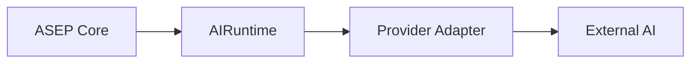

# AI Runtime provider-agnostic

**Dono:** Engenharia ASEP | **Versão:** 0.1 | **Status:** vigente

## Objetivo

`asep.ai_runtime` define a porta para geração externa ou local sem expor
SDK, transporte, payload ou identidade fechada de fornecedor ao Core.

`AIRuntimeRequest` representa intenção, contexto JSON e metadados. O resultado
normaliza output, identidade extensível, consumo opcional e metadados. A
identidade usa strings validadas para `runtime_id`, `model_id` e capabilities;
não existe enum de fornecedores.

## Fronteiras

- adapters concretos pertencem à fronteira de integração/infraestrutura;
- o contrato não substitui `AgentProvider`, que executa `ExecutionPackage`;
- o contrato não substitui `AgentRuntime`, que controla lifecycle de agentes;
- o registry somente guarda instâncias injetadas e não descobre providers;
- nenhuma credencial, SDK, chamada HTTP ou provider real integra esta entrega;
- `WorkspaceProject` permanece inalterado; seleção futura deverá usar uma
  configuração separada do domínio de projeto.

## Codex adapter

`CodexAIRuntime` usa o modo oficial não interativo `codex exec`. O comando
habilita JSONL, sessão efêmera e sandbox somente leitura; o processo recebe um
workspace existente e explicitamente configurado como `cwd`. A ASEP não usa
seu próprio diretório corrente nem habilita acesso irrestrito.

O adapter reutiliza o `ProcessRunner` do provider legado, que concentra
`subprocess`, mantém `shell=False` e oferece timeout e captura portáveis. O
`CodexProvider` existente continua distinto: ele traduz `ExecutionPackage`
para `AgentExecutionResult`, enquanto `CodexAIRuntime` traduz intenção
`AIRuntimeRequest` para `AIRuntimeResult`.

A autenticação permanece integralmente sob o cliente oficial. O usuário pode
usar o fluxo oficial `codex login`, e `codex exec` reutiliza a sessão salva. A
ASEP não lê, copia ou persiste tokens. **Login do ChatGPT usado pelo cliente
Codex oficial não é equivalente a uma API key gerenciada pela ASEP.**

O JSONL oficial fornece a mensagem final e pode fornecer contagem estruturada
de tokens; somente nesse caso ela é mapeada para `AIRuntimeUsage`. O adapter
não estima tokens nem custos.

## Erros

A hierarquia distingue configuração, autenticação, indisponibilidade, rate
limit, timeout, resposta inválida e falha inesperada. Mensagens canônicas não
incluem payloads, credenciais nem a mensagem original de exceções externas.
