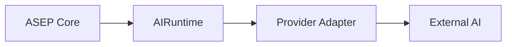

# AI Runtime provider-agnostic

**Dono:** Engenharia ASEP | **Versão:** 0.1 | **Status:** vigente

## Objetivo

`asep.ai_runtime` define a porta para geração externa ou local sem expor
SDK, transporte, payload ou identidade fechada de fornecedor ao Core.

`AIRuntimeRequest` representa intenção, contexto JSON e metadados. O resultado
normaliza output, identidade extensível, consumo opcional e metadados. A
identidade usa strings validadas para `runtime_id`, `model_id` e capabilities;
não existe enum de fornecedores.

## Fronteiras

- adapters concretos pertencem à fronteira de integração/infraestrutura;
- o contrato não substitui `AgentProvider`, que executa `ExecutionPackage`;
- o contrato não substitui `AgentRuntime`, que controla lifecycle de agentes;
- o registry somente guarda instâncias injetadas e não descobre providers;
- nenhuma credencial, SDK, chamada HTTP ou provider real integra esta entrega;
- `WorkspaceProject` permanece inalterado; seleção futura deverá usar uma
  configuração separada do domínio de projeto.

## Erros

A hierarquia distingue configuração, autenticação, indisponibilidade, rate
limit, timeout, resposta inválida e falha inesperada. Mensagens canônicas não
incluem payloads, credenciais nem a mensagem original de exceções externas.
