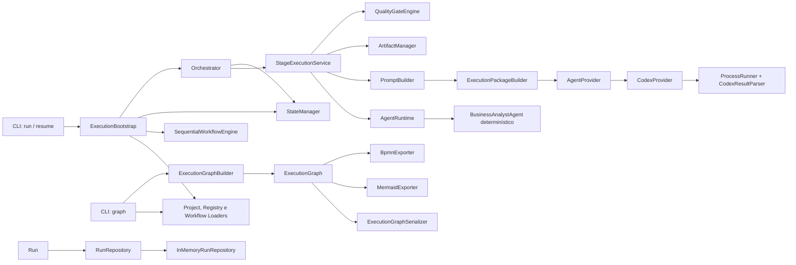

# ASEP — Arquitetura v1

**Público:** pessoas desenvolvedoras e mantenedoras  
**Dono:** Engenharia ASEP  
**Versão:** 1.0  
**Status:** vigente em 2026-07-29

## Objetivo

A ASEP é uma aplicação local que carrega projetos e catálogos versionados,
valida workflows, coordena etapas sequenciais, executa agentes internos ou um
provider injetado, persiste estado e artefatos e projeta workflows em formatos
de intercâmbio.

## Visão e filosofia

A implementação é um monólito modular Python. Modelos Pydantic formam os
contratos entre módulos; loaders isolam YAML e filesystem; serviços de
aplicação coordenam casos de uso; adaptadores encapsulam processos externos e
formatos de saída. A evolução é incremental: contratos existentes são
reutilizados e capacidades não suportadas falham explicitamente.

Princípios observados:

- validação estrita nas fronteiras;
- dependências explícitas e injetáveis;
- coordenação separada da execução interna de uma etapa;
- artefatos, estado e pacotes escritos atomicamente;
- prompts e pacotes determinísticos e neutros de fornecedor;
- representação canônica antes da visualização;
- erros esperados tipados e apresentados sem traceback pela CLI;
- suporte executável atual limitado a workflows sequenciais.

## Componentes e fluxo real

O caminho `PromptBuilder → ExecutionPackageBuilder → AgentProvider` ocorre
somente quando um provider é injetado no `Orchestrator` ou diretamente no
`StageExecutionService`. A construção padrão usada pela CLI `run` não injeta
provider e executa o `BusinessAnalystAgent`. O comando `graph` cria atualmente
uma projeção estática do workflow; ele não lê um run nem relatórios de etapas.

## Limites

| Módulo | Pode depender de | Não deve depender de |
|---|---|---|
| `models`, `execution.models` | Pydantic e biblioteca padrão | CLI e adaptadores externos |
| `execution.engine` | workflow e estado tipados | filesystem, provider e exporters |
| `application` | domínio, portas, loaders e adaptadores injetados | CLI |
| `orchestrator` | serviços de aplicação e máquina de estados | subprocess e serialização de exporters |
| `prompting` | seus modelos | provider, processo e filesystem |
| `execution_package` | prompting e seus modelos | providers concretos e workflow engine |
| `providers` | `ExecutionPackage`, contrato e infraestrutura de processo | workflow engine, orchestrator e quality gates |
| `execution_graph` | workflow/estado/resultados necessários à projeção | CLI e exporters |
| `exporters` | `ExecutionGraph`, erros e bibliotecas de formato | workflow engine, orchestrator, providers concretos |
| `cli` | casos de uso, loaders, builder e exporters públicos | detalhes internos de subprocess/layout |

Regras confirmadas no código:

- providers não dependem do Workflow Engine;
- `ExecutionPackage` não depende de provider concreto;
- `PromptBuilder` não executa providers;
- `StageExecutionService` usa o protocolo `AgentProvider`, não `CodexProvider`;
- integrações externas são adaptadores (`CodexProvider`, `ProcessRunner`,
  exporters e loaders);
- Mermaid e BPMN recebem somente `ExecutionGraph`.

Exceção conhecida: `execution_graph.models` e `execution_graph.builder`
importam `AgentExecutionStatus` de `asep.providers.models`. Portanto, a regra
“ExecutionGraph nunca depende de Providers” ainda não é verdadeira na v1.

## Extensibilidade

- Novo provider: implemente `AgentProvider`, devolva `AgentExecutionResult`,
  isole transporte/processo e injete o objeto.
- Novo exporter: aceite `ExecutionGraph`, produza uma string pura e exponha
  apenas a API intencional em `asep.exporters`.
- Novo quality gate: preserve o contrato `GateResult`; hoje não existe um
  protocolo público de gates, portanto substituir o engine requer injeção de
  objeto compatível.
- Novo comando CLI: componha APIs públicas e preserve stdout utilizável por
  pipelines, stderr operacional e erros `AsepError`.

Detalhes estão em [Providers](Providers.md), [Exporters](Exporters.md) e
[CLI](CLI.md).

## Situação e roadmap

As limitações e próximos marcos estão em [Roadmap](Roadmap.md). Divergências
documentais encontradas:

1. o [ADR-013](../../projects/asep-self-development/decisions/ADR-013-ai-provider-extensibility.md)
   proibia provider de IA no MVP, mas `AgentProvider` e `CodexProvider` foram
   implementados posteriormente sem ADR supersessor encontrado;
2. a independência total de `ExecutionGraph` em relação a providers não existe;
3. `ExecutionPackageWriter` existe, mas o fluxo com provider passa o pacote em
   memória e não o persiste;
4. `awaiting_approval` existe na máquina de estados, porém `prepare_resume`
   aceita somente `failed` e `blocked`;
5. o `pyproject.toml` declara Python `>=3.12`, enquanto requisitos recentes
   mencionam compatibilidade com Python 3.11.

## Documentos

- [Core Domain](Core-Domain.md)
- [Execution](Execution.md)
- [Execution Package](ExecutionPackage.md)
- [Execution Graph](ExecutionGraph.md)
- [Providers](Providers.md)
- [Exporters](Exporters.md)
- [CLI](CLI.md)
- [Roadmap](Roadmap.md)
- [Run Repository](RunRepository.md)
- [Revisão de consistência arquitetural](Architectural-Consistency-Review.md)
- [ADR-015 proposto](decisions/ADR-015-provider-boundaries-and-execution-graph-isolation.md)
- [Plano de refatoração proposto](Provider-Graph-Refactoring-Plan.md)
