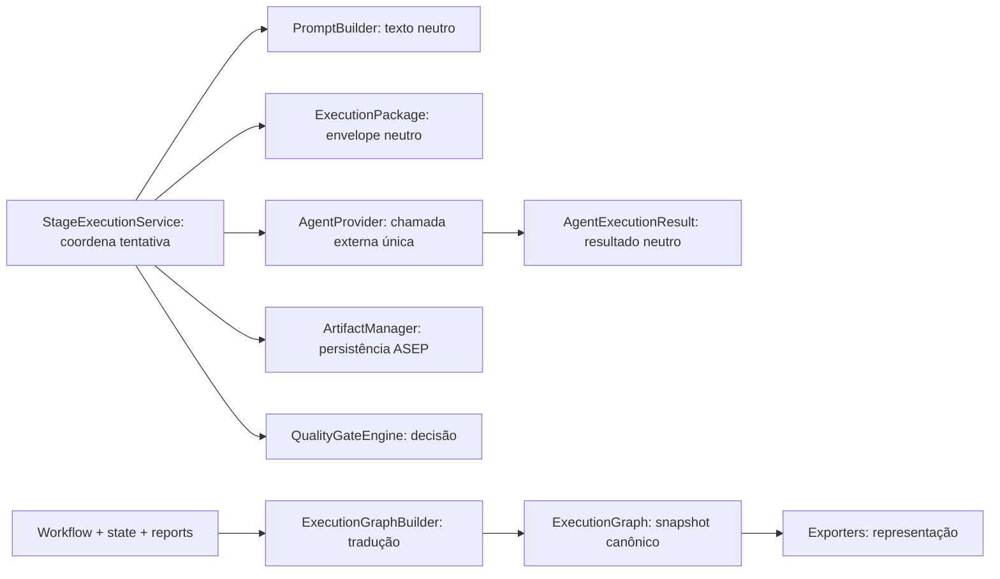

# Revisão de consistência arquitetural — Sprint 5.6.1

**Dono:** Software Architect | **Versão:** 1.0 | **Status:** review  
**Data:** 2026-07-29

## Escopo e evidências

Foram comparados os ADRs 001–014 do projeto, o ADR-001 de limites do core,
Architecture v1, módulos públicos, imports e testes de providers, package,
StageExecutionService, graph, exporters e CLI.

Legenda: **C** conforme; **P** parcialmente conforme; **N** não conforme.

## Matriz de conformidade

| Regra arquitetural | Status atual | Evidência | Classe | Ação recomendada |
|---|---|---|---|---|
| Provider recebe `ExecutionPackage` | implementado | `providers/protocol.py` | C | preservar |
| Provider devolve `AgentExecutionResult` | implementado | `providers/models.py` | C | preservar |
| Provider não coordena workflow | sem imports ou lógica de workflow | `providers/` | C | teste de boundary |
| Provider encapsula processo, timeout e parsing | separado em runner/parser | `codex.py`, `process.py`, `parser.py` | C | preservar |
| Provider não persiste artefatos ASEP | apenas declara produced files | `models.py`, `codex.py` | C | esclarecer contrato |
| Retry não pertence ao provider | nenhum retry implementado | `codex.py` | C | definir política antes de implementar |
| PromptBuilder não conhece provider | apenas modelos próprios | `prompting/` | C | teste de boundary |
| ExecutionPackage independe de provider | nenhum import de provider | `execution_package/` | C | preservar |
| StageExecutionService usa porta genérica | recebe `AgentProvider` | `application/stage_execution.py` | C | preservar |
| StageExecutionService não transiciona estado | retorna report | `stage_execution.py` | C | preservar |
| Falha tipada do provider vira resultado failed | conversão no serviço | `_execute_with_provider` | C | preservar testes |
| Graph representa plano e execução | entradas opcionais | `execution_graph/builder.py` | C | explicitar `created_from` |
| Graph é imutável e serializável | frozen + serializer JSON | `models.py`, `serializer.py` | C | preservar |
| Graph não depende de provider | importa `AgentExecutionStatus` | `execution_graph/models.py` | N | tipo graph-owned |
| Graph não depende de modelos externos concretos | importa execução e artifact ref | `execution_graph/models.py` | N | snapshots graph-owned |
| Builder traduz modelos-fonte | concentra projeção | `execution_graph/builder.py` | C | formalizar como boundary |
| Builder não conhece exporters | nenhum import | `builder.py` | C | teste de boundary |
| Exporters dependem somente do graph | imports arquiteturais restritos ao graph | `mermaid.py`, `bpmn.py` | C | preservar |
| Exporters não escrevem arquivos | retornam `str` | testes de exporters | C | preservar |
| CLI somente seleciona exporter | seleção explícita | `cli.py` | C | preservar |
| ADR-013 descreve arquitetura vigente | proíbe provider existente | ADR-013 versus `providers/` | N | superseder com ADR-015 |
| Pacote é persistido no fluxo provider | writer não é chamado | `stage_execution.py` | P | manter opcional ou decidir requisito |
| `ProducedFile` vira artefato persistido | preservado apenas em metadata | `_to_agent_result` | P | definir semântica futura |

## Responsabilidades decididas

## Comparação ADR versus implementação

- ADR-001 do projeto: monólito modular — conforme.
- ADR-002: intenção de camadas — parcialmente conforme; nomes físicos atuais
  são orientados por capacidade, mas fronteiras principais são testáveis.
- ADR-003 e ADR-006: atomicidade existe; single-writer/lock e `last_event_id`
  não foram implementados.
- ADR-007: retomada explícita existe; reconciliação de versões/inputs é parcial.
- ADR-008: decisões existem, mas o modelo atual é mais simples e usa `BLOCKED`
  em vez de `failed`.
- ADR-009: estados de aprovação existem; comando approve/reject não existe.
- ADR-010: JSONL diagnóstico existe; audit trail separado não foi localizado.
- ADR-011: artefatos têm checksum/metadata, mas o Business Analyst atual gera
  conteúdo deterministicamente sem Jinja2.
- ADR-012: suíte orientada a contratos e falhas — conforme.
- ADR-013: não conforme após introdução de providers.
- ADR-014: engine continua fail-closed para paralelo/condicional — conforme.
- ADR-001 em `docs/architecture/decisions`: proposta incompleta e com fence
  Markdown não encerrada; direção geral parcialmente refletida.

## Riscos para JSON Graph

1. Serializar enums externos funciona hoje, mas vincula o schema conceitual à
   taxonomia de provider/execução.
2. Trocar classes concretas por snapshots próprios pode alterar JSON Schema e
   validação Python, mesmo mantendo o JSON produzido.
3. `ArtifactReference` carrega identidade de persistência; um exporter futuro
   pode passar a depender acidentalmente desse contrato.
4. `metadata: Mapping[str, Any]` é serializável apenas se os valores inseridos
   permanecerem suportados pelo serializer.
5. Renomear status ou mudar casing exige nova `schema_version`.
6. JSON público deve ter golden tests, schema version, ordenação e política de
   leitura de versões anteriores antes de ser anunciado.

## Decisão proposta

Adotar o [ADR-015](decisions/ADR-015-provider-boundaries-and-execution-graph-isolation.md):
providers são adaptadores de uma tentativa externa; graph models são
autônomos; o builder é a única fronteira de tradução; exporters recebem apenas
o grafo.

## Pendências

- aprovação do ADR-015 pelo Software Architect;
- change request separado para qualquer refatoração;
- política de dados/threat model para provider remoto;
- decisão sobre persistência automática do ExecutionPackage;
- contrato semântico para `ProducedFile`;
- correção documental dos ADRs parcialmente implementados em sprint própria.
