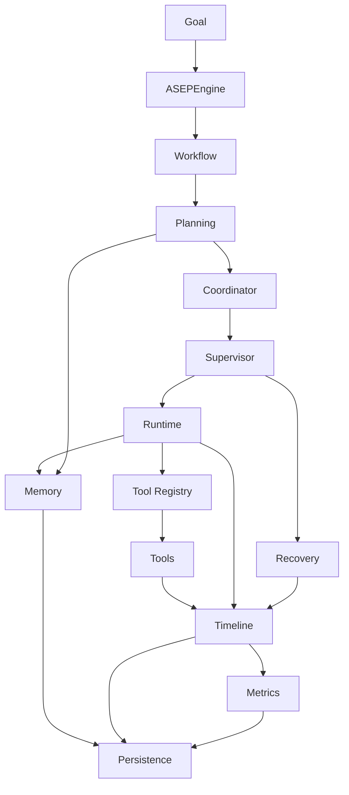

# Mapa da arquitetura ASEP

**Dono:** Engenharia ASEP | **Versão:** 2.3 | **Status:** atualizado até a Fase 17

## Visão Geral

Mapa em cinco níveis para localizar responsabilidades sem substituir a
[Architecture v1](ASEP-Architecture-v1.md).

## O Problema

Um único diagrama detalhado é difícil para iniciantes e insuficiente para
arquitetos que investigam dependências.

## A Solução

Apresentar alto nível, módulos, componentes, execução e dados.

## Explicação simples

A ASEP recebe comandos, coordena trabalho, guarda resultados e oferece
consultas. Cada andar conhece apenas os andares necessários.

## Explicação técnica

### 1. Visão de alto nível

```text
Entradas -> Aplicação -> Domínio/Execução -> Infraestrutura
                         |                    |
                         +---- Persistência --+
```

Entradas não implementam domínio; infraestrutura adapta processos e storage.

### 2. Visão por módulos

```text
cli/api
  |
  v
application/orchestrator ----> execution/workflow
  |                                  |
  v                                  v
configuration -> repositories     prompting/package/providers
                       |
          +------------+------------+
          v            v            v
        memory         file        sqlite
```

### 3. Visão por componentes de persistência

```text
Configuration -> ApplicationSettings -> RepositoryFactory
                                            |
                         +------------------+------------------+
                         v                                     v
               RunRepository                         TimelineRepository
               /      |      \                       /      |       \
          memory     file   sqlite               memory    file    sqlite
                              \                              /
                               +--> SQLiteDatabase <--------+
```

### 4. Fluxo de execução

```text
CLI run -> ExecutionBootstrap -> Orchestrator -> StageExecutionService
                                                   |
                              runtime ou prompt/package/provider
                                                   |
                                      artifacts + quality gate
```

### 5. Fluxo de dados de consulta

```text
asep.db -> SQLite repositories -> RunQueryService -> MetricsService
                                   |                    |
                                   +------> Dashboard API
                                   `------> History CLI
```

Cada diagrama reduz o nível de detalhe para uma pergunta diferente.

### Workflow genérico da Sprint 8.1

```text
Workflow -> WorkflowOrchestrator -> Run/Timeline ports
   |
   `-> WorkflowEngine -> Validator -> Executor -> Steps -> Result
```

Esse coordenador valida infraestrutura com Steps simuladas. Ele não substitui
o Orchestrator de projetos do fluxo de execução.

### Contratos e Registry de agentes

```text
Composition -> InMemoryAgentRegistry -> Agent
                                      -> AgentStepAdapter -> WorkflowStep
                                                            -> Engine
```

O Engine não consulta o Registry. A composição resolve o agente e monta a Step.

### Persistência de workflow

```text
Orchestrator -> PersistenceService -> WorkflowRepository
                                      /      |      \
                                  memory    file   sqlite
```

O snapshot referencia Timeline e métricas sem armazenar objetos vivos.

### Runtime inteligente

```text
WorkflowEngine -> AgentStepAdapter -> AgentRuntime -> AgentExecutionService
                                                   /        |         \
                                             Registry    Timeline   Metrics
                                                 |
                                               Agent
```

O Engine continua sem resolver agentes. O runtime aplica validação, política,
correlação, segurança e observabilidade sem conhecer providers concretos.

### Tools

```text
Agent Runtime -> ToolExecutor -> ToolExecutionService
                                  /       |       \
                            ToolRegistry Timeline Metrics
                                  |
             read/list/search/docs/run-tests Tools
```

Filesystem e subprocesso ficam atrás de Tools restritas ao workspace.

### Memória operacional

```text
Agent Runtime -> ContextProvider -> ContextBuilder -> MemoryService
                                                   -> MemoryStore
                                                      /       \
                                                 memory      sqlite
```

O Runtime não conhece Store concreto; o Workflow alcança memória somente pelo
Runtime e adapter já existentes.

### Planejamento

```text
Workflow/Agent Runtime -> Planner -> PlanningEngine
                                    /      |       \
                              Strategy  Validator  Timeline/Metrics
                                    |
                    Memory + ToolRegistry + Workflow
```

O plano é solicitado antes da execução. O Planning Engine descreve e valida o
trabalho, mas não executa Agent, Tool ou WorkflowStep.

### Coordenação multiagente

```text
ExecutionPlan -> AgentCoordinator -> CapabilityResolver -> Assignments
                                      |
                                      v
                              Sequential Queue
                                      |
                                      v
                                AgentRuntime
                                      |
                                      v
                              ResultAggregator
```

O Coordinator depende de contratos e do AgentRegistry. Ele nunca executa Tool
diretamente; paralelismo e distribuição permanecem fora da implementação.

### Supervisão e recuperação

```text
AgentCoordinator -> ExecutionSupervisor -> AgentRuntime
                           |
                           v
              StateMachine + RecoveryService
                     /              \
              Retry/Backoff        Fallback
```

Supervisor implementa a porta do Runtime. Planning, Workflow e Coordinator não
conhecem políticas internas de recuperação.

### Pipeline ponta a ponta

```text
asep.execute -> ASEPEngine -> ExecutionPipeline -> Workflow
                                      |
                     Planning -> Coordination -> Supervisor
                                      |
                         Runtime -> Agent -> Tools
                                      |
                         Memory + Timeline + Metrics
                                      |
                                  GoalResult
```

PipelineBuilder é a composition root. A fachada não expõe as dependências ao
consumidor.

### Diagrama oficial do RC2



O fluxo vertical representa coordenação. As setas transversais representam
dependências observadas: Recovery envolve Supervisor/Runtime; Memory, Timeline,
Metrics e Persistence não são etapas lineares executadas uma única vez.

### Software Engineering Intelligence

```text
Project Path -> ProjectScanner -> Deterministic Detectors
                                      |
                     languages/frameworks/dependencies/
                     entrypoints/architecture/statistics
                                      |
                                      v
                              ProjectAnalysis
```

`project_analysis` é independente do pipeline. A Sprint 10.1 não o integra a
Runtime, Workflow, agentes, providers ou persistência.

### Pipeline inteligente e geração validada

```text
Business Engineering -> Planning -> Intelligent Orchestrator
                                      |
                                      v
                              Agent Coordination
                                      |
                                      v
                                Agent Runtime
                                      |
                                      v
                                DeveloperAgent
                                      |
                                      v
                               Tool Execution
                                /           \
                         Filesystem        pytest
                                \           /
                                 v         v
                                  Artifacts
                                      |
                                      v
                                Quality Gates
```

O Intelligent Orchestrator é a composição, não o executor interno das camadas.
Agents alcançam filesystem e testes somente por Tools restritas ao workspace.
O gate avalia o resultado contratual do agente; não interpreta pytest
diretamente.

### Software Repair

```text
pytest FAILED -> FailureAnalyzer -> RepairPlanner -> RepairLoop
                                           |             |
                                           v             v
                                      RepairPlan -> RepairExecutor
                                                    /          \
                                             WriteFileTool  RunTestsTool
```

Repair produz novos planos para falhas funcionais. `runtime.recovery` continua
responsável apenas por retry/backoff/fallback operacional. Quality Gate não
executa o loop e permanece uma fronteira separada.

## Componentes envolvidos

CLI/API, application, execution, workflow, agents, providers, artifacts,
quality, configuration, repositories, SQLite, Query, Metrics e exporters.

## Fluxo completo

Configuração escolhe infraestrutura; execução produz estado/artefatos;
repositories expõem Runs/Timeline; consultas projetam histórico e métricas.

## Dependências

Consumidores dependem de contratos. Providers não conhecem Orchestrator.
Exporters dependem de ExecutionGraph. Serviços não conhecem adapters SQLite.
Veja [Dependencies](../persistence/Dependencies.md).

## Exemplos

Trocar `memory` por `sqlite` altera `ApplicationSettings`, não
`RunQueryService`.

## Testes

Testes unitários por módulo, contratos compartilhados e integrações CLI/API
evidenciam os fluxos. Testes arquiteturais inspecionam imports/construções.

## Erros comuns

Interpretar seta como fluxo de dados quando ela representa dependência; assumir
que todos os componentes participam de todo comando.

## Limitações

O mapa não representa cada classe, estado ou divergência histórica. Consulte
documentos especializados.

## Evolução futura

Atualizar níveis afetados somente após mudanças implementadas.

## Referências

[Architecture v1](ASEP-Architecture-v1.md),
[SQLite Architecture](../persistence/SQLiteArchitecture.md) e
[Execution](Execution.md). Auditoria:
[ArchitectureAudit](../audits/ArchitectureAudit.md).

## Relacionado a

Sprints 7.5, 8.4 e 9.1–9.8; Fases 07–17; ADRs 016, 020 e 022–032; módulos; testes;
Roadmap; RC2; auditoria documental até a Fase 16.
