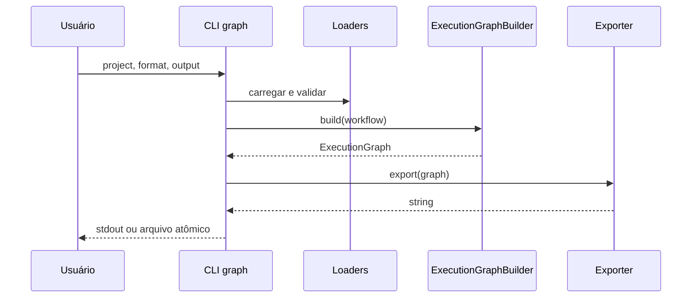

# CLI

**Dono:** Engenharia ASEP | **Versão:** 1.0 | **Status:** vigente

O entry point `asep = asep.cli:app` usa Typer. Mensagens operacionais usam
stderr quando o stdout precisa permanecer consumível por pipelines.

## Comandos

| Comando | Responsabilidade |
|---|---|
| `asep run PROJECT` | cria UUID v4, configura log e inicia execução |
| `asep resume RUN_ID` | localiza `state.yaml` no workspace e retoma |
| `asep graph PROJECT` | carrega workflow, constrói grafo estático e exporta |

Opção `--verbose/-v` existe em `run` e `resume`.

## Graph

```text
asep graph PROJECT [--format mermaid|bpmn] [--output/-o PATH] [--force]
```

Mermaid é o formato padrão. Sem `--output`, apenas o documento gerado é escrito
no stdout. Com arquivo, a confirmação vai para stderr. Qualquer extensão é
aceita sem renomear ou alertar.

```bash
asep graph projects/asep-self-development
asep graph projects/asep-self-development --format bpmn
asep graph projects/asep-self-development --format bpmn -o workflow.bpmn
asep graph projects/asep-self-development -o workflow.mmd --force
```

A escrita cria o diretório pai e um temporário curto no mesmo filesystem.
Sem `--force`, `os.link` fornece criação exclusiva; com `--force`, `os.replace`
substitui atomicamente. Falhas removem o temporário.



## Erros

Erros esperados descendem de `AsepError`, possuem código e exit code e são
impressos sem traceback. Validação de opções do Typer retorna código diferente
de zero antes de criar saída. O CLI não executa Codex real no comando `graph`.

## Adicionar comando

1. componha APIs públicas existentes;
2. use tipos e validação Typer;
3. mantenha conteúdo de pipeline no stdout e operação no stderr;
4. converta erros esperados pelo padrão `AsepError`;
5. reutilize escrita segura quando produzir arquivo;
6. acrescente testes com `CliRunner`;
7. não replique lógica de domínio ou de exporter.
