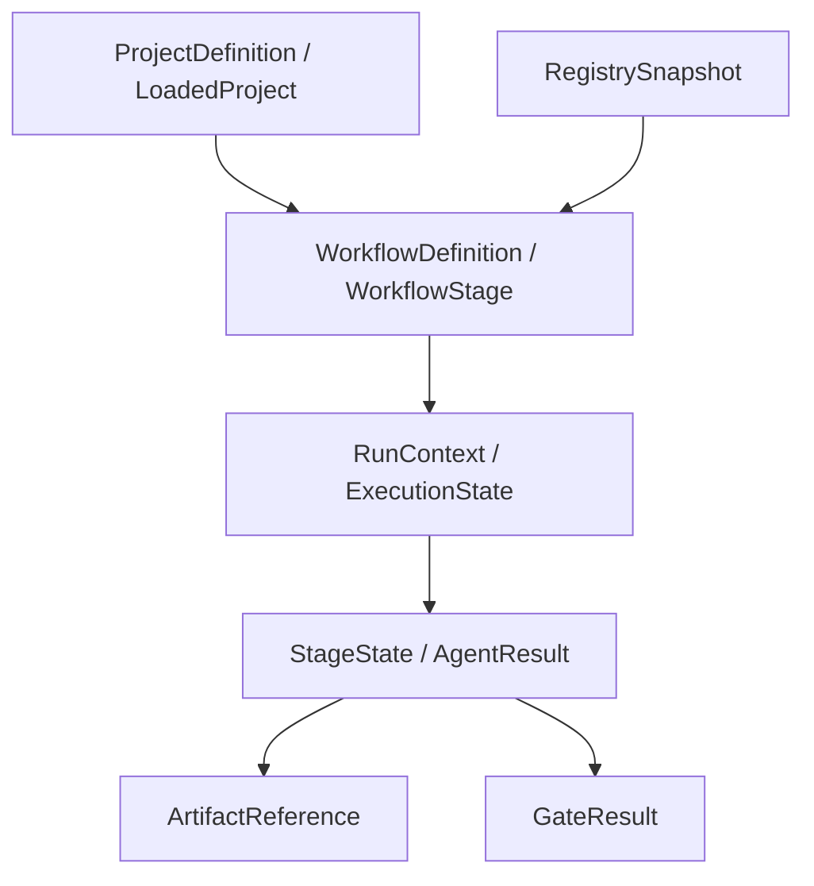
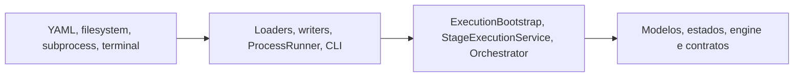

# Core Domain

**Dono:** Engenharia ASEP | **Versão:** 1.0 | **Status:** vigente

## Limite do domínio

O núcleo tipado está principalmente em `asep.models` e
`asep.execution.models`. Ele descreve projeto, Registry, workflow, execução,
etapas, resultados, artefatos e gates. Loaders, persistência, subprocess, CLI e
exporters são infraestrutura ou coordenação, não entidades de domínio.

## Modelos e invariantes

| Conceito | Modelo | Invariantes relevantes |
|---|---|---|
| Projeto carregado | `LoadedProject` | manifesto validado, README UTF-8 e paths resolvidos |
| Registry | `RegistrySnapshot` | IDs únicos, referências existentes e cruzadas |
| Workflow | `WorkflowDefinition` | etapas e atribuições coerentes, dependências conhecidas e acíclicas |
| Execução | `RunContext`, `ExecutionState` | `run_id` UUID v4 e identidade consistente |
| Etapa | `StageState` | agente selecionado, tentativas incrementadas ao entrar em `running` |
| Agente interno | `AgentContext`, `AgentResult` | identidade do run/etapa/agente e status explícito |
| Artefato | `ArtifactDraft`, `ArtifactReference` | referência contém origem, checksum e path relativo |
| Gate | `GateResult` | decisão `APPROVED`, `APPROVED_WITH_PENDING` ou `BLOCKED` |

Os modelos de estado são mutáveis porque as transições são aplicadas pelo
`StateManager`. Contextos, referências e modelos de integração críticos usam
configuração frozen quando apropriado.

## Serviços

- `SequentialWorkflowEngine`: valida e seleciona a próxima etapa elegível.
- `StateManager`: aplica transições e persiste snapshots.
- `AgentRuntime`: valida o agente registrado e seu resultado.
- `QualityGateEngine`: avalia critérios verificáveis.
- `ArtifactManager`: restringe paths e persiste conteúdo e metadados.

## Domínio versus infraestrutura

O domínio não contém comandos CLI nem conhece o processo Codex. Uma exceção de
acoplamento está registrada em [Execution Graph](ExecutionGraph.md):
`ExecutionGraph` usa atualmente um enum definido no pacote de providers.

## Limites atuais

- execução apenas sequencial;
- exatamente um agente atribuído por etapa executável;
- condições e etapas `parallel` são rejeitadas;
- não há locking de run para processos concorrentes;
- aprovação humana possui estados, mas não um fluxo completo de aprovação;
- persistência local é a única implementação.
