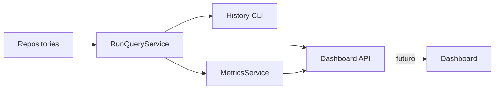

# Dashboard API

**Dono:** Engenharia ASEP | **Versão:** 0.1.0 | **Status:** interna e experimental

## Propósito

A Dashboard API é um adaptador HTTP FastAPI, somente leitura, sobre
`RunQueryService` e `MetricsService`. Ela prepara o backend de um dashboard
futuro sem mover regras de consulta ou métricas para a camada HTTP.



## Factory e composição

`asep.api.create_app(query_service, metrics_service)` cria uma aplicação
isolada, registra routers e handlers, e guarda as dependências injetadas em
`app.state`. As rotas recebem os serviços por closure e não os constroem.

`asep.api.create_default_app()` é o composition root local. Somente esse módulo
conhece `InMemoryRunRepository` e `InMemoryTimelineRepository`. Cada chamada
cria repositories e serviços novos; não há singleton global compartilhado.

## Endpoints v1

| Método | Path | Resultado |
|---|---|---|
| GET | `/api/v1/health` | estado local da API |
| GET | `/api/v1/runs` | Runs na ordem do RunQueryService |
| GET | `/api/v1/runs?status=failed` | filtro tipado delegado ao serviço |
| GET | `/api/v1/runs/{run_id}` | detalhes de um Run |
| GET | `/api/v1/runs/{run_id}/timeline` | eventos cronológicos |
| GET | `/api/v1/metrics/summary` | resumo calculado pelo MetricsService |
| GET | `/api/v1/metrics/status` | todos os RunStatus na ordem do domínio |
| GET | `/api/v1/metrics/providers` | providers na ordem do domínio |

`/api/v1/metrics/stages` foi omitido porque o MetricsService adiou métricas de
stage por ausência de identidade de tentativa e resultado estruturado.

Não existem endpoints POST, PUT, PATCH ou DELETE.

## Schemas e serialização

Schemas HTTP vivem exclusivamente em `asep.api.schemas`. Eles convertem os
modelos neutros sem alterar sua semântica:

- timestamps permanecem ISO 8601 com timezone;
- enums usam seus valores estáveis;
- metadata permanece uma árvore JSON;
- taxas continuam como proporções entre 0 e 1;
- durações permanecem números em segundos;
- provider ausente permanece `null`;
- coleções preservam a ordem devolvida pelos serviços.

Não há `repr()` de objetos, paths, prompts, stdout ou stderr nas respostas.

## Erros

Handlers centralizados devolvem:

```json
{
  "error": {
    "code": "RUN_NOT_FOUND",
    "message": "Run not found."
  }
}
```

- Run inexistente: 404;
- run_id vazio ou inválido no serviço: 400;
- request incompatível com o schema: 422;
- outros erros de domínio: 400;
- erro inesperado: 500 genérico.

Respostas não incluem traceback, exception, arquivo, linha ou configuração.

## OpenAPI e execução local

OpenAPI está disponível em `/openapi.json` e Swagger UI em `/docs`.

Instale o projeto com o extra de testes quando necessário:

```text
python -m pip install -e ".[test]"
```

Execute localmente com o factory mode do Uvicorn:

```text
python -m uvicorn asep.api.composition:create_default_app --factory --host 127.0.0.1
```

Não use `--reload` quando precisar manter os dados em memória: reload recria a
aplicação e perde o conteúdo.

## Segurança e limitações

- não há autenticação ou autorização;
- CORS não é habilitado;
- a API não deve ser exposta publicamente ou usada em produção;
- bind local em `127.0.0.1` é a opção documentada;
- não há TLS, rate limit ou proteção multi-tenant;
- metadata é devolvida como registrada; o produtor continua responsável por
  não armazenar segredos ou dados pessoais nela;
- repositories padrão são voláteis e não estão integrados ao lifecycle;
- reiniciar o processo apaga os dados;
- não há frontend, persistência, cache, background task, streaming ou deploy.

Persistência, autenticação, deployment seguro e frontend exigem decisões e
sprints futuras.
