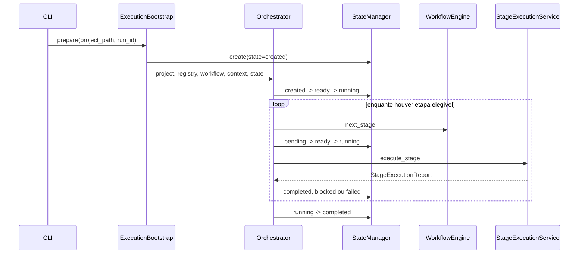
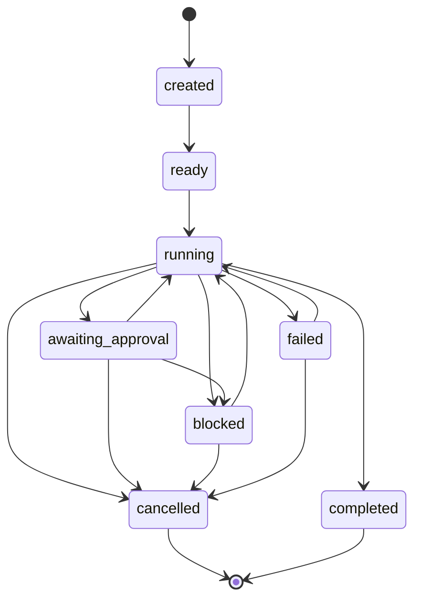

# Execution

**Dono:** Engenharia ASEP | **Versão:** 1.0 | **Status:** vigente

## Responsabilidades

### ExecutionBootstrap

Carrega projeto, localiza a raiz, carrega Registry e workflow, verifica
aplicabilidade, valida com `SequentialWorkflowEngine`, monta paths, cria
`RunContext` e solicita ao `StateManager` o estado `created`. Em `resume`,
recarrega e reconcilia o estado existente sem criar outro run.

### Orchestrator

É o coordenador: inicia ou retoma, mantém o loop, aplica transições, salva o
estado e decide concluir, bloquear ou falhar. Ele não constrói prompt/pacote,
não executa subprocess e não persiste conteúdo de artefato.

### StageExecutionService

Monta o `AgentContext`; executa pelo `AgentRuntime` quando não há provider ou
constrói prompt e pacote para o `AgentProvider` injetado; normaliza o resultado;
persiste artefatos somente após sucesso; avalia e persiste o quality gate.
Retorna `StageExecutionReport` sem transicionar estados.

## Nova execução

## Retomada

`resume(state_path)` preserva o `run_id`, recarrega projeto/Registry/workflow e
valida a identidade. `StateManager.prepare_resume` aceita apenas execuções
`failed` ou `blocked`, transiciona a execução para `running` e o loop seleciona
a primeira etapa não concluída. Etapas `completed` são terminais e não são
executadas novamente.

Apesar de a tabela de transições permitir `awaiting_approval → running`, a API
de retomada atual rejeita esse estado. Não existe nesta versão um comando de
aprovação humana.

## Estados

Etapas seguem máquina equivalente, com `pending → ready → running` e estados
terminais adicionais `skipped`, `cancelled` e `completed`. Cada transição gera
`TransitionRecord`. O snapshot YAML é validado antes de `os.replace`.

## Persistência e riscos

- estado: `<project>/.asep/runs/<run_id>/state.yaml`;
- artefatos: `<project>/artifacts/runs/<run_id>`;
- logs: `<project>/logs/runs/<run_id>.jsonl`;
- pacotes, quando `ExecutionPackageWriter` é chamado explicitamente:
  `<project>/.asep/runs/<run_id>/packages/<stage_id>`.

Não há lock ou controle otimista entre processos. Duas retomadas simultâneas do
mesmo run podem perder atualizações; a operação atômica protege o arquivo contra
escrita parcial, não contra concorrência lógica.
