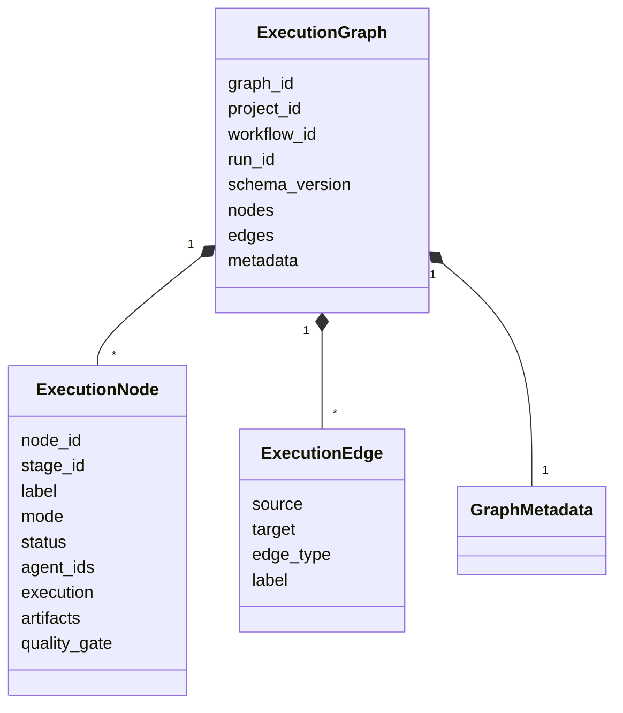
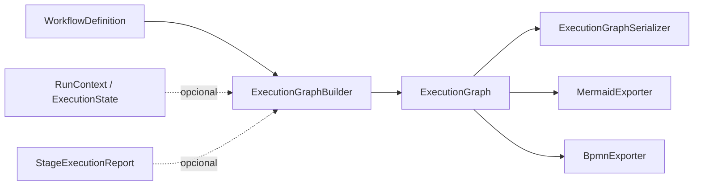

# Execution Graph

**Dono:** Engenharia ASEP | **Versão:** 1.0 | **Status:** vigente

## Modelo canônico

`ExecutionGraph` é a representação imutável e independente de visualização
usada por serializers e exporters. Um nó representa uma etapa; uma aresta
`dependency` representa uma dependência dirigida.

## Conteúdo

`NodeStatus` cobre pending, ready, running, awaiting approval, completed,
failed, blocked, skipped, cancelled e partial. `NodeExecutionDetails` preserva
status de agente/provider, identidade do provider, timestamps, duração,
tentativa, exit code, warnings e errors. Nós também podem conter
`ArtifactReference` e `QualityGateSummary`.

Invariantes do modelo:

- IDs de nó únicos e não vazios;
- arestas únicas, sem self-loop e com endpoints conhecidos;
- totais e contagens de status coerentes;
- schema version coerente entre grafo e metadados;
- metadados congelados.

## Builder e serializer

`ExecutionGraphBuilder.build` recebe `WorkflowDefinition` e, opcionalmente,
`RunContext`, `ExecutionState`, relatórios por etapa e nome do projeto. Ele
valida correspondência de identidades, ordena topologicamente, associa
resultados e gera edges determinísticas. Ciclos são rejeitados.

`ExecutionGraphSerializer` produz JSON compacto e determinístico, com chaves
ordenadas, UTF-8 preservado e newline final.

O CLI `graph` usa apenas workflow e nome do projeto; portanto seus nós ficam
`pending` e não representam uma execução persistida.

## Dependência conhecida

A meta arquitetural é que o grafo não dependa de providers. A implementação v1
não satisfaz totalmente essa regra: `NodeExecutionDetails` tipa
`provider_result_status` com `AgentExecutionStatus`, importado de
`asep.providers.models`; o builder também importa esse enum. Exporters,
entretanto, dependem somente da API do grafo e não acessam providers.
