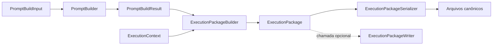

# Execution Package

**Dono:** Engenharia ASEP | **Versão:** 1.0 | **Status:** vigente

## Objetivo

`ExecutionPackage` é o envelope imutável e neutro de fornecedor entregue a um
`AgentProvider`. O builder combina exatamente um `PromptBuildResult` com
contexto estruturado e checksums, sem IO.

## Estrutura

- `manifest`: protocolo, versões, identidades, origem e checksums;
- `task`: prompt Markdown final (`task.md`);
- `context`: projeto, workflow, etapa, inputs, contrato e gate;
- `metadata`: gerador e versão do Python;
- `expected_outputs`: saídas esperadas normalizadas;
- `constraints`: restrições normalizadas.

O contexto inclui `ExecutionSubject`, `ExecutionInput`,
`ExecutionContract`, `ExecutionQualityGate`, perguntas abertas e contexto
adicional.

## Arquivos serializados

| Arquivo | Conteúdo |
|---|---|
| `manifest.yaml` | manifesto e checksums |
| `task.md` | tarefa pronta para execução |
| `context.json` | contexto estruturado |
| `metadata.json` | metadados do gerador |
| `expected_outputs.json` | saídas esperadas |
| `constraints.md` | restrições |

O `CodexProvider` consome em sua entrada `task.md`, `manifest.yaml`,
`context.json` e `constraints.md`. Ele não chama `PromptBuilder`.

## Determinismo e segurança

Coleções relevantes são ordenadas e deduplicadas. JSON canônico usa chaves
ordenadas e UTF-8; checksums usam SHA-256. Identificadores do manifesto não
aceitam separadores de path. O writer usa temporário no diretório final e
`os.replace`, além de evitar reescrever bytes idênticos.

## Independência e uso real

O pacote não importa providers e seus campos `provider` permanecem `None`. No
fluxo atual do `StageExecutionService`, o pacote é passado em memória ao
provider. O `ExecutionPackageWriter` é uma API pública disponível, mas não é
chamado automaticamente por esse fluxo.
