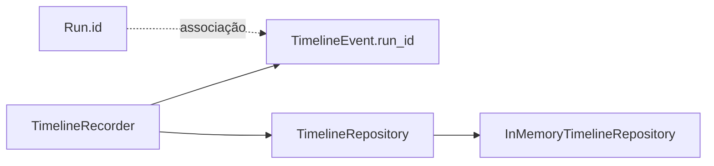

# Execution Timeline

**Dono:** Engenharia ASEP | **Versão:** 1.0 | **Status:** implementado sem integração

## Objetivo

O pacote `asep.timeline` registra eventos neutros, imutáveis e cronológicos
associados a um Run por `run_id`. Nesta versão, repository e recorder existem
para composição e testes, mas ainda não estão conectados ao Orchestrator.



## TimelineEvent

| Campo | Regra |
|---|---|
| `id` | identidade global, não vazia |
| `run_id` | associação não vazia; não embute `Run` |
| `timestamp` | datetime com timezone |
| `type` | `TimelineEventType` |
| `stage_id` | texto opcional |
| `message` | texto opcional |
| `metadata` | árvore JSON profundamente imutável |

O evento é um modelo Pydantic estrito e frozen. Ele não armazena providers,
exceptions, subprocessos, pacotes, engine, grafo, callbacks ou classes.

## Tipos suportados

- `run.started`;
- `run.finished`;
- `stage.started`;
- `stage.finished`;
- `provider.started`;
- `provider.finished`;
- `warning`;
- `error`.

Novos valores podem ser acrescentados ao enum sem mudar os valores atuais.

## TimelineRepository

```python
class TimelineRepository(Protocol):
    def append(self, event: TimelineEvent) -> None: ...
    def list_by_run(self, run_id: str) -> tuple[TimelineEvent, ...]: ...
```

`append` aceita somente IDs ainda não registrados. Duplicidade global gera
`DuplicateTimelineEventError`, inclusive quando os eventos pertencem a runs
diferentes.

`list_by_run` retorna cópias profundas em tupla, ordenadas por timestamp e,
para timestamps iguais, por ID. Run sem eventos retorna tupla vazia. Consulta
com `run_id` vazio é rejeitada.

## Implementação em memória

`InMemoryTimelineRepository` mantém armazenamento isolado por instância e
índices em memória por `run_id`. Os dados são perdidos no encerramento do
processo. Não há arquivo, banco, concorrência multiprocesso, retenção ou
paginação.

## TimelineRecorder

O recorder recebe a porta de repository e, opcionalmente:

- `clock: Callable[[], datetime]`;
- `id_generator: Callable[[], str]`.

Por padrão usa UTC e UUID v4. `record` cria, persiste e devolve o evento.
`record_error` converte uma exception recebida em mensagem e
`metadata.exception_type`, sem traceback ou armazenamento da exception.

Falhas do recorder/repository são propagadas. Como ainda não há instrumentação
do fluxo, não existe risco de uma falha secundária mascarar uma falha principal
da execução. Uma integração futura deverá preservar explicitamente a exceção
primária.

## Relação com RunRepository

Os repositories são independentes:

- Timeline não consulta nem grava `RunRepository`;
- existência do Run não é validada na porta de persistência;
- a camada de aplicação deverá garantir a criação do Run antes dos eventos;
- não há lista mutável de eventos dentro de `Run`.

Isso evita dependência circular e permite persistências diferentes no futuro.

## Integração adiada

O Orchestrator ainda não cria ou atualiza `Run`, logo injetar apenas o recorder
permitiria eventos associados a registros inexistentes. Antes da instrumentação
é necessário decidir:

1. mapeamento entre `ExecutionStatus` e `RunStatus`;
2. atomicidade entre estado, Run e Timeline;
3. semântica de resume e tentativas;
4. deduplicação/idempotência em retomadas;
5. política quando o recorder falha durante uma exceção primária.

Após essa decisão, pontos claros já existem: criação/início do run, transições
de stage, chamada ao provider e encerramentos controlados.
