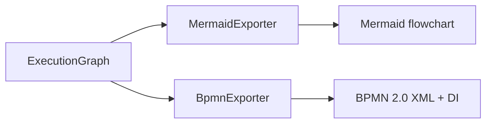

# Exporters

**Dono:** Engenharia ASEP | **Versão:** 1.0 | **Status:** vigente

## Arquitetura

Exporters são projeções puras: recebem `ExecutionGraph`, retornam `str`, não
escrevem arquivos, não consultam serviços externos e não modificam o grafo.

## MermaidExporter

Produz `flowchart`, aceita direção TD/TB/LR/RL/BT e estilos opcionais por
`NodeStatus`. Sanitiza IDs, resolve colisões por SHA-256 estável, escapa labels
e representa `EdgeType.DEPENDENCY` como seta. A saída é determinística e termina
com newline.

## BpmnExporter

Produz definitions, um process não executável, start/end events, tasks,
sequence flows, parallel gateways quando necessários e BPMN Diagram
Interchange. O layout determinístico segue níveis da esquerda para a direita,
com bounds e waypoints ortogonais. Grafo vazio gera start → end; ciclos são
rejeitados.

Namespaces: BPMN Model, BPMN DI, DC, DI e XML Schema Instance.

## Criar um exporter

1. receba somente `ExecutionGraph` e opções estritas;
2. não carregue workflow, run ou projeto;
3. não escreva arquivo dentro do exporter;
4. defina escaping, IDs, ordenação e newline;
5. falhe com erro tipado em semântica não suportada;
6. teste determinismo e não mutação;
7. exponha a classe em `asep.exporters`;
8. integre à CLI por seleção explícita, reutilizando o escritor existente.

A persistência de saída pertence à CLI. Não existe `BaseExporter` nem registry
de plugins.
