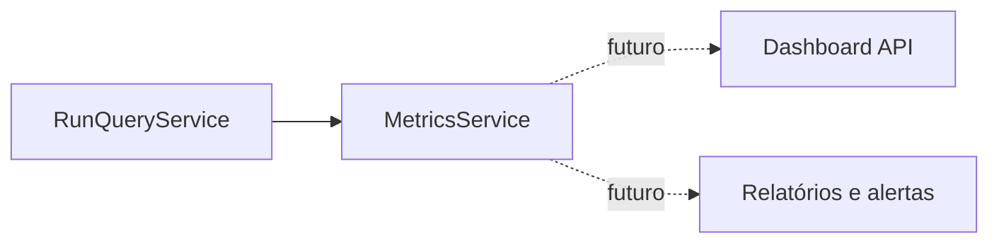

# Metrics Service

**Dono:** Engenharia ASEP | **Versão:** 1.0 | **Status:** implementado sem persistência

## Propósito e posição

`MetricsService` calcula snapshots analíticos somente leitura sobre os Runs
disponibilizados por `RunQueryService`.



O serviço não acessa RunRepository, TimelineRepository, providers, CLI,
ExecutionGraph ou exporters. Não mantém cache nem estado acumulado: cada método
obtém um snapshot por uma única chamada a `list_runs()` e calcula sob demanda.

## API e contratos

```python
service = MetricsService(run_query_service)
summary = service.get_summary()
status = service.count_by_status()
durations = service.get_duration_metrics()
providers = service.metrics_by_provider()
```

Os resultados são modelos Pydantic frozen, estritos e serializáveis:

- `MetricsSummary`;
- `StatusMetrics`;
- `DurationMetrics`;
- `ProviderMetrics`.

Mappings livres não fazem parte do contrato. Resultados por status seguem a
ordem de `RunStatus`; providers usam ordem lexicográfica, com provider ausente
(`null`) antes dos identificadores textuais. Nomes não são normalizados.

## Definições

- total: quantidade de Runs do snapshot;
- sucesso: status `succeeded`;
- falha: status `failed`;
- em andamento: somente status `running`;
- pendente e cancelado: contagens independentes;
- status legado desconhecido: contado em `unknown_status_runs`;
- elegível para taxa: somente `succeeded + failed`;
- taxa de sucesso: `successful_runs / eligible_runs`;
- taxa de falha: `failed_runs / eligible_runs`;
- nenhuma execução elegível: ambas as taxas são `0.0`;
- taxas são proporções entre 0 e 1, sem arredondamento.

Runs pending, running e cancelled não participam das taxas. Sucesso nunca é
inferido pela ausência de `Run.error`; falha nunca é inferida por mensagem ou
metadata.

## Duração

A duração é `finished_at - started_at`, em segundos. O serviço não consulta o
relógio atual. Runs ativos, timestamps ausentes, tipos incompatíveis, duração
negativa e valores não finitos são excluídos das estatísticas e incluídos em
`ignored_count`.

`DurationMetrics` contém:

- `count` e `ignored_count`;
- mínimo e máximo;
- média aritmética;
- mediana.

Quando `count` é zero, todas as estatísticas são `null`. Valores válidos não são
arredondados antecipadamente.

## Provider

`metrics_by_provider()` usa somente `Run.provider_name`. Provider ausente é uma
categoria explícita representada por `null`, sem inventar um nome. Cada grupo
contém as mesmas contagens, taxas e estatísticas de duração definidas acima.
Não existe dependência de provider concreto.

## Métricas de stage adiadas

Taxas e resultados por stage não são confiáveis no contrato atual:

- um Run representa a execução e `stage_id` é apenas a etapa atual ou
  relacionada;
- Timeline possui eventos `stage.started` e `stage.finished`, mas não registra
  resultado estruturado, identidade de tentativa ou vínculo inequívoco entre
  erro e tentativa;
- retries e eventos repetidos não podem ser deduplicados semanticamente.

Por isso, esta versão não oferece `metrics_by_stage()`. Contar eventos como
execuções ou inferir sucesso de `stage.finished` produziria números enganosos.
Essa métrica depende de um contrato futuro de tentativa e resultado de stage.

## Limitações

- os repositories atuais são em memória e ainda não estão integrados ao
  lifecycle, portanto as métricas não são duráveis;
- não há filtros, cache, persistência, CLI, dashboard ou API de métricas;
- não há promessa de snapshot transacional entre chamadas diferentes;
- project e workflow existem no Run, mas métricas por essas dimensões estão
  fora do escopo;
- o serviço não altera Runs, TimelineEvents ou metadata.
