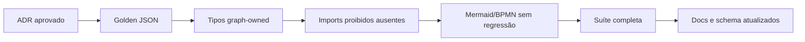

# Plano de refatoração — providers e ExecutionGraph

**Dono:** Engenharia ASEP | **Versão:** 1.0 | **Status:** proposed  
**Pré-condição:** aprovação do
[ADR-015](decisions/ADR-015-provider-boundaries-and-execution-graph-isolation.md)

Este plano não autoriza alterações. Cada fase requer change request e gate.

## Ordem recomendada

| Ordem | Prioridade | Mudança | Risco | Módulos | Compatibilidade | Testes necessários |
|---|---|---|---|---|---|---|
| 1 | P0 | aprovar ADR e congelar exemplos JSON | baixo | docs, tests | nenhuma API | golden JSON e inventário de imports |
| 2 | P0 | adicionar testes de dependências proibidas | baixo | tests | nenhuma | AST/import boundary em graph, providers e exporters |
| 3 | P1 | criar enums graph-owned equivalentes | médio | `execution_graph.models`, builder | possível quebra de comparação de enum Python | model, builder, serializer, exporters |
| 4 | P1 | criar snapshots graph-owned de artefato e resultado | alto | models, builder | tipos Python mudam; JSON deve permanecer | golden JSON, schema, round-trip, stage reports |
| 5 | P1 | remover imports de execution/provider dos graph models | médio | graph | objetivo da migração | boundary + suíte completa |
| 6 | P2 | versionar schema se qualquer JSON mudar | alto | serializer, API pública futura | migração explícita | fixtures v1, determinismo e compatibilidade |
| 7 | P2 | decidir persistência de package e semântica de ProducedFile | médio | application/package/artifacts | pode alterar efeitos observáveis | integração e fault injection |
| 8 | P2 | atualizar catálogo e ADR-013 após aprovação | baixo | documentação | nenhuma | links/status |

## Estratégia de compatibilidade

1. capture o JSON atual de grafos estático e executado;
2. introduza tipos novos mantendo nomes, valores, ordenação e nulabilidade;
3. mantenha `NodeStatus` e `EdgeType` públicos;
4. avalie aliases temporários somente se consumidores externos forem
   identificados;
5. compare saída byte a byte;
6. incremente `EXECUTION_GRAPH_SCHEMA_VERSION` se houver diferença;
7. não publique JSON exporter antes de definir leitura/versionamento.

## Breaking changes possíveis

- tipo Python de `provider_result_status`;
- tipo Python de `agent_result_status`;
- tipo de itens em `ExecutionNode.artifacts`;
- tipo de `QualityGateSummary.decision`;
- JSON Schema gerado pelo Pydantic;
- imports usados por consumidores ainda não inventariados.

Os valores JSON atuais podem ser preservados (`success`, `failed`,
`completed`, decisões de gate e campos de artefato), reduzindo o impacto para
consumidores textuais.

## Gates por fase

Critérios mínimos:

- nenhuma importação de workflow/execution/provider em graph models;
- builder é o único tradutor;
- JSON determinístico e versionado;
- Mermaid e BPMN preservados;
- providers/package continuam contract-compatible;
- suíte completa e compileall verdes;
- migração e rollback documentados.

## Rollback

Manter a mudança em commits separados por fase. Se o JSON ou exporters
divergirem sem decisão de versão, reverter apenas a fase de tipos e preservar
os testes de boundary como `xfail` ligado ao issue aprovado, nunca relaxar o
contrato silenciosamente.

## Riscos

- falsa compatibilidade por comparar somente JSON e ignorar API Python;
- aliases perpetuarem acoplamento;
- `Any` em metadata introduzir valor não serializável;
- refatoração misturar mudança de contrato com JSON exporter;
- scope creep para Run Repository, retry ou providers novos.
