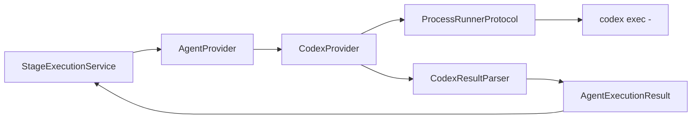

# Providers

**Dono:** Engenharia ASEP | **Versão:** 1.0 | **Status:** vigente

## Contrato

`AgentProvider` é um `Protocol` runtime-checkable com atributo `name` e método:

```python
def execute(self, package: ExecutionPackage) -> AgentExecutionResult: ...
```

`AgentExecutionResult` é neutro de fornecedor e informa status, identidade e
versão do provider, exit code, stdout, stderr, arquivos produzidos, warnings,
errors e metadados imutáveis. Status possíveis: success, failed, partial,
cancelled e timeout.



## CodexProvider

Configura executável, timeout, diretório de trabalho, ambiente, encoding e
versão. Serializa o pacote em memória, monta uma entrada delimitada e executa
`codex exec -`. `ProcessRunner` concentra `subprocess.run`, disponibilidade,
timeout, captura e portabilidade. `CodexResultParser` converte exit code e
streams no resultado canônico.

Erros de disponibilidade, execução e protocolo são `ProviderError`. No
`StageExecutionService`, esses erros são convertidos em
`AgentExecutionResult.failed`; falhas já representadas pelo resultado não
dependem de exceção.

## Criar um provider

1. implemente `name` e `execute(ExecutionPackage)`;
2. devolva sempre `AgentExecutionResult` consistente;
3. crie configuração frozen e tipada;
4. isole SDK, rede ou processo em adaptador testável;
5. separe parsing do transporte;
6. mapeie indisponibilidade e falhas operacionais para erros de provider;
7. use fake de transporte nos testes;
8. exponha apenas a API intencional em `asep.providers`;
9. injete o provider; não o instancie no serviço de aplicação.

Providers não conhecem workflow engine, orchestrator, artefatos ou quality
gates. O `StageExecutionService` conhece apenas o protocolo genérico.

## Situação do ADR

O ADR-013 afirmava que o MVP não criaria `AIProvider`. A implementação posterior
criou `AgentProvider` e `CodexProvider`; nenhum ADR supersessor foi localizado.
Esse documento registra o código vigente, não altera retroativamente o ADR.
