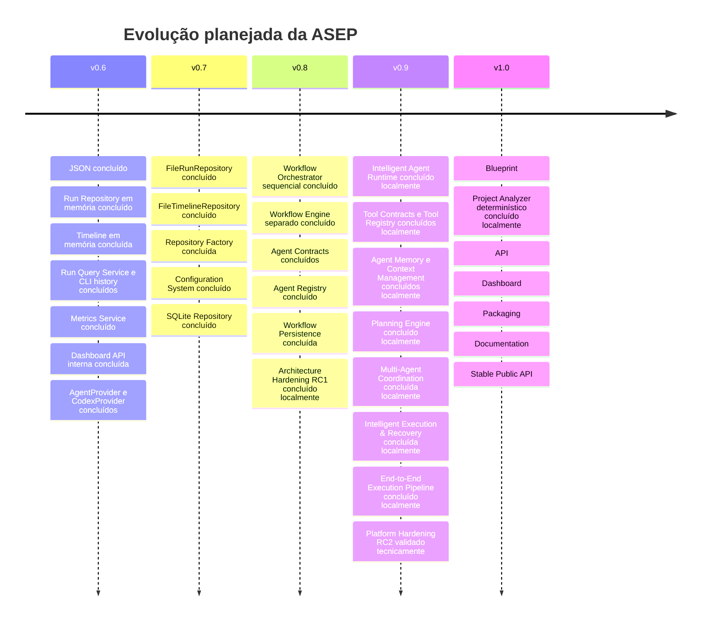

# Roadmap arquitetural

**Dono:** Engenharia ASEP | **Versão:** 1.0 | **Status:** planejado

O roadmap registra intenção, não compromisso nem comportamento implementado.
Mudanças de contrato exigem decisão arquitetural e testes.

O estado operacional, inclusive diferenças entre trabalho local e remoto, está
em [PROJECT_STATE](../../project/PROJECT_STATE.md). A próxima Sprint só deve ser
iniciada após o handoff descrito em
[NEXT_STEPS](../../project/NEXT_STEPS.md); esta fotografia não atribui número
novo aos itens futuros.

## v0.6

- exporter JSON — implementado;
- modelo e contrato Run Repository com implementação em memória — implementado;
- modelo, repository e recorder de Timeline em memória — implementados;
- consultas unificadas e interface CLI de histórico em memória — implementadas;
- integração da Timeline ao lifecycle e persistência durável — planejadas;
- Metrics Service somente leitura — implementado;
- Dashboard API interna e somente leitura — implementada;
- provider Codex por `AgentProvider`; Claude não está implementado.

## v0.8

- 8.1 Workflow Orchestrator sequencial e simulável — implementado;
- 8.2 Workflow Engine separado — implementado;
- 8.3 Agent Contracts e adapter de Step — implementado;
- 8.4 Agent Registry em memória — implementado;
- 8.5 Workflow Persistence — implementado;
- 8.6 Architecture Hardening & RC1 — concluído localmente;

## v0.9

- 9.1 Intelligent Agent Runtime — implementado localmente;
- 9.2 Tool Contracts & Tool Registry — implementada localmente;
- 9.3 Agent Memory & Context Management — implementada localmente;
- 9.4 Planning Engine — implementada localmente.
- 9.5 Multi-Agent Coordination — implementada localmente.
- 9.6 Intelligent Execution & Recovery — implementada localmente.
- 9.7 End-to-End Execution Pipeline — implementada localmente; fachada pública
  Python disponível.
- 9.8 Platform Hardening & Release Candidate 2 — validada tecnicamente;
  publicação depende de gates operacionais.

O runtime é síncrono, resolve agentes pelo Registry e integra Timeline e
métricas. Paralelismo, agentes autônomos, memória semântica e infraestrutura
distribuída continuam fora do estado implementado.

Itens futuros sem Sprint aprovada:

- execução paralela real;
- cancelamento coordenado;
- Dashboard MVP.

## v0.7

- 7.1 FileRunRepository — implementado;
- 7.2 FileTimelineRepository — implementado;
- 7.3 Repository Factory — implementada;
- 7.4 Configuration System — implementado;
- 7.5 SQLite Repository — implementado.

Entregas da fase de persistência v0.7:

- portas `RunRepository` e `TimelineRepository` preservadas;
- backends `memory`, `file` e `sqlite` substituíveis;
- criação centralizada pela `RepositoryFactory`;
- configuração imutável por defaults e variáveis `ASEP_*`;
- schema SQLite automático para Runs e Timeline;
- testes de contrato compartilhados entre os três backends;
- documentação de repositories, schema, arquitetura e configuração em
  [`docs/persistence`](../persistence/SQLiteRepositories.md).

A aplicação padrão continua usando repositories em memória. O sistema
`Configuration` centraliza defaults e overrides pelas variáveis `ASEP_*`,
produzindo um `ApplicationSettings` imutável consumido pela
`RepositoryFactory`. O backend `sqlite` compartilha um banco entre Runs e
Timeline, selecionável por `ASEP_STORAGE_BACKEND=sqlite` e
`ASEP_SQLITE_DATABASE`. YAML, TOML, JSON e configuração por CLI permanecem fora
do escopo.

## v1.0

- 10.1 Project Analyzer determinístico — implementado localmente;
- Blueprint;
- API;
- Dashboard;
- packaging;
- documentação;
- API pública estável.

## Pré-condições arquiteturais

- preservar o isolamento ExecutionGraph/exporters confirmado pelo ADR-015;
- definir concorrência e locking antes de Run Repository/paralelismo;
- definir fluxo humano antes de retomar `awaiting_approval`;
- preservar Python mínimo `>=3.12` em código, pacote e documentação;
- versionar contratos públicos antes da estabilidade v1.0.
