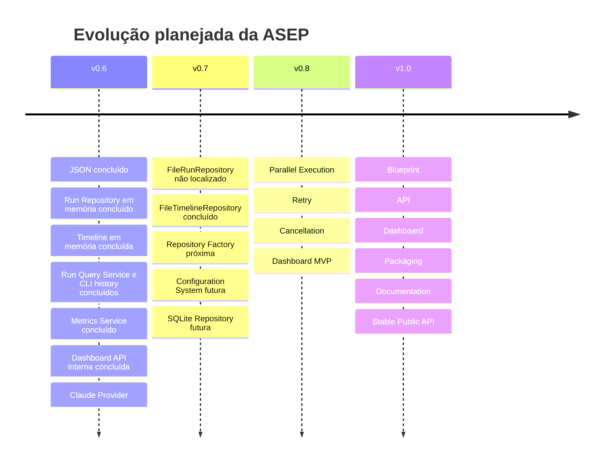

# Roadmap arquitetural

**Dono:** Engenharia ASEP | **Versão:** 1.0 | **Status:** planejado

O roadmap registra intenção, não compromisso nem comportamento implementado.
Mudanças de contrato exigem decisão arquitetural e testes.

## v0.6

- exporter JSON — implementado;
- modelo e contrato Run Repository com implementação em memória — implementado;
- modelo, repository e recorder de Timeline em memória — implementados;
- consultas unificadas e interface CLI de histórico em memória — implementadas;
- integração da Timeline ao lifecycle e persistência durável — planejadas;
- Metrics Service somente leitura — implementado;
- Dashboard API interna e somente leitura — implementada;
- Claude Provider por `AgentProvider`.

## v0.8

- execução paralela real;
- política de retry;
- cancelamento coordenado;
- Dashboard MVP.

## v0.7

- 7.1 FileRunRepository — não localizado no HEAD `b949a6c`; inconsistência de
  pré-condição registrada;
- 7.2 FileTimelineRepository — implementado;
- 7.3 Repository Factory — próximo, não iniciado;
- 7.4 Configuration System — futuro;
- 7.5 SQLite Repository — futuro.

A aplicação padrão continua usando repositories em memória. A implementação em
arquivo exige injeção explícita até uma decisão futura de composição.

## v1.0

- Blueprint;
- API;
- Dashboard;
- packaging;
- documentação;
- API pública estável.

## Pré-condições arquiteturais

- remover ou aceitar formalmente o acoplamento ExecutionGraph → provider model;
- superseder o ADR-013 para reconhecer providers externos;
- definir concorrência e locking antes de Run Repository/paralelismo;
- definir fluxo humano antes de retomar `awaiting_approval`;
- alinhar a versão mínima de Python;
- versionar contratos públicos antes da estabilidade v1.0.
