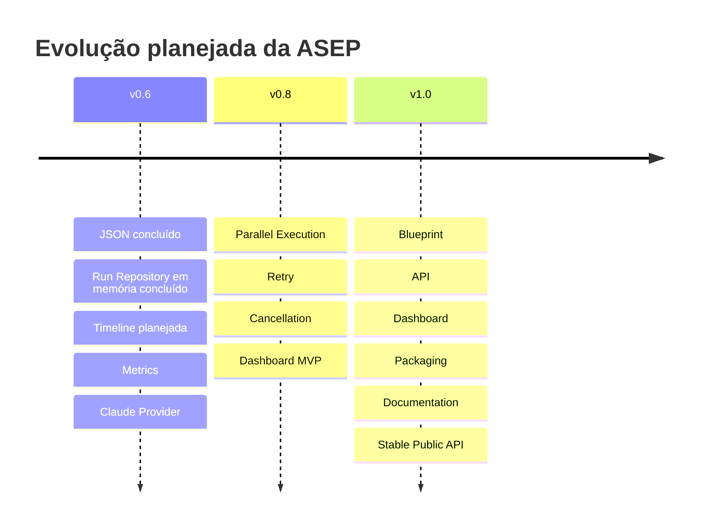

# Roadmap arquitetural

**Dono:** Engenharia ASEP | **Versão:** 1.0 | **Status:** planejado

O roadmap registra intenção, não compromisso nem comportamento implementado.
Mudanças de contrato exigem decisão arquitetural e testes.

## v0.6

- exporter JSON — implementado;
- modelo e contrato Run Repository com implementação em memória — implementado;
- timeline derivada do histórico;
- métricas;
- Claude Provider por `AgentProvider`.

## v0.8

- execução paralela real;
- política de retry;
- cancelamento coordenado;
- Dashboard MVP.

## v1.0

- Blueprint;
- API;
- Dashboard;
- packaging;
- documentação;
- API pública estável.

## Pré-condições arquiteturais

- remover ou aceitar formalmente o acoplamento ExecutionGraph → provider model;
- superseder o ADR-013 para reconhecer providers externos;
- definir concorrência e locking antes de Run Repository/paralelismo;
- definir fluxo humano antes de retomar `awaiting_approval`;
- alinhar a versão mínima de Python;
- versionar contratos públicos antes da estabilidade v1.0.
