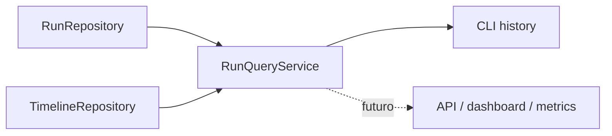

# Run Query Service e histórico na CLI

**Dono:** Engenharia ASEP | **Versão:** 1.0 | **Status:** implementado sem durabilidade

## Responsabilidade

`RunQueryService` é a camada somente leitura entre `RunRepository`,
`TimelineRepository` e consumidores como a CLI. O serviço depende apenas dos
dois Protocols, não conhece implementações concretas, providers, workflow,
ExecutionGraph, exporters ou apresentação.



As operações públicas são:

- `list_runs()` — tupla ordenada por `started_at` decrescente e `id`
  crescente como desempate;
- `get_run(run_id)` — devolve um Run ou propaga `RunNotFoundError`; ID vazio é
  entrada inválida;
- `get_timeline(run_id)` — primeiro confirma que o Run existe e depois devolve
  eventos por `timestamp` crescente e `id` crescente;
- `latest_run()` — usa a mesma ordenação de `list_runs` e gera
  `RunNotFoundError` quando o repository está vazio;
- `list_runs_by_status(status)` — aceita somente `RunStatus` e preserva a
  ordenação da listagem.

Run existente sem eventos possui Timeline vazia. Os modelos `Run` e
`TimelineEvent` são frozen e profundamente imutáveis, portanto não foi criado
DTO de consulta.

## Apresentação e comandos

A CLI existente já reserva `asep run PROJECT`. Para preservar esse contrato e o
padrão de comandos planos do Typer, os comandos de histórico são:

```text
asep runs [--status pending|running|succeeded|failed|cancelled]
asep run show RUN_ID
asep run timeline RUN_ID
```

O roteamento de `run` reconhece `show` e `timeline` como ações reservadas e
continua tratando os demais valores como `PROJECT`. Assim, as consultas usam
estrutura hierárquica sem quebrar `asep run PROJECT`. Não há aliases planos.

As listagens usam texto simples determinístico e ISO 8601. Campos ausentes usam
`-`; duração finalizada usa `HH:MM:SS` (com prefixo de dias quando necessário)
e Run ativo usa `running`. Metadata e detalhes do erro são JSON compacto com
chaves ordenadas. Timeline vazia e repository vazio produzem mensagem clara e
exit code zero.

Erros `AsepError` usam stderr, mensagem sem traceback e seu `exit_code`. Status
inválido é erro de uso do Typer com exit code 2.

## Composição e limitação

`application.query_composition` carrega `ApplicationSettings` por
`Configuration`, solicita à `RepositoryFactory` uma instância compartilhada de
cada repository e mantém o serviço durante a vida do processo. A configuração
padrão seleciona memória. A CLI depende apenas da função de composição,
substituível em testes.

Essa composição **não é histórico durável**:

- `InMemoryRunRepository` e `InMemoryTimelineRepository` perdem dados ao
  encerrar o processo;
- comandos iniciados em processos independentes não veem dados uns dos outros;
- o lifecycle atual ainda não grava Runs ou eventos nesses repositories;
- os comandos mostram dados reais somente quando um processo hospedeiro compõe
  e alimenta as mesmas instâncias;
- esta entrega não adiciona arquivo, banco, reconciliação ou integração com o
  Orchestrator.

Uma persistência futura pode implementar os mesmos Protocols sem alterar o
serviço ou os formatadores. O [Metrics Service](MetricsService.md) consome essa
camada sem acessar os repositories diretamente.
