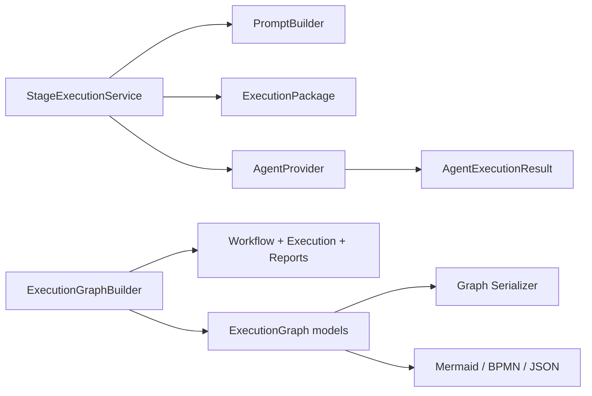

# ADR-015 — Limites de providers e isolamento do ExecutionGraph

**ID:** ADR-015 | **Versão:** 1.0.0 | **Status:** review  
**Dono:** Software Architect | **Data:** 2026-07-29  
**Fontes:** [Architecture v1](../ASEP-Architecture-v1.md),
[revisão de consistência](../Architectural-Consistency-Review.md),
[ADR-013](../../../projects/asep-self-development/decisions/ADR-013-ai-provider-extensibility.md)

## Objetivo

Fixar as fronteiras entre execução, providers, representação canônica e
exporters. Esta decisão não autoriza a refatoração; ela define o estado-alvo e
o gate para um change request posterior.

## Contexto

O ADR-013 adiou integrações externas e declarou o agente como único ponto de
extensão. As Sprints 4 e 5 introduziram `ExecutionPackage`, `AgentProvider`,
`CodexProvider`, `AgentExecutionResult`, `ExecutionGraph` e exporters. A
arquitetura implementada demonstrou uma segunda fronteira real: execução
externa neutra de fornecedor.

O número 015 continua a sequência global aceita ADR-001–ADR-014 do projeto. O
diretório `docs/architecture/decisions` já contém outro ADR-001, em status
proposto, evidenciando uma duplicidade histórica de namespace que este ADR não
renumera.

`StageExecutionService` já coordena prompt, pacote, provider, artefatos e gate.
Providers recebem `ExecutionPackage` e devolvem `AgentExecutionResult`.
Exporters recebem `ExecutionGraph`.

## Problemas

1. O ADR-013 não descreve a fronteira de provider que agora existe.
2. `ExecutionGraph` é descrito como neutro, mas seus modelos importam tipos
   pertencentes a `asep.execution.models` e `asep.providers.models`.
3. É necessário distinguir o modelo canônico da tradução feita pelo builder.
4. Retry, artefatos e parsing precisam ter um único responsável.
5. O contrato JSON futuro não pode herdar acoplamentos Python acidentais.

## Inconsistências existentes

- `execution_graph.models` importa `AgentResultStatus`,
  `ArtifactReference`, `GateDecision` e `AgentExecutionStatus`;
- `execution_graph.builder` conhece tipos de workflow, execução, relatório de
  etapa e provider, como esperado de uma fronteira de projeção, mas essa
  distinção não estava formalizada;
- o ADR-013 aceito proíbe a abstração hoje implementada;
- `ExecutionPackageWriter` é público, porém não participa automaticamente do
  caminho provider;
- `ProducedFile` registra efeitos informados pelo provider, mas o fluxo atual
  persiste stdout como artefato ASEP e apenas preserva produced files em
  metadata.

## Alternativas

1. Remover `AgentProvider` e voltar ao agente determinístico: rejeitada, pois
   elimina capacidade implementada e testada.
2. Permitir que cada exporter e provider acesse os modelos de execução:
   rejeitada por acoplamento e duplicação.
3. Manter o acoplamento do grafo e apenas documentá-lo: rejeitada porque
   fragiliza JSON, novos exporters e evolução de providers.
4. Definir contratos neutros e usar `ExecutionGraphBuilder` como camada de
   tradução: decisão escolhida.

## Decisão

### Provider boundaries

`AgentProvider` é uma porta de saída para um adaptador externo:

- entrada única: `ExecutionPackage`;
- saída única: `AgentExecutionResult`;
- pode conhecer serialização do pacote, SDK/processo/transporte, configuração
  própria, timeout da chamada e parsing da resposta;
- deve executar uma tentativa solicitada e relatar o resultado;
- não aplica retry de workflow; política de retry pertence à coordenação de
  execução futura;
- não persiste artefatos ASEP; pode declarar `ProducedFile` como efeito;
- não avalia quality gates;
- não chama `PromptBuilder`;
- não carrega projeto, Registry ou workflow;
- não conhece Orchestrator, Workflow Engine, StageExecutionService,
  ArtifactManager, QualityGateEngine, ExecutionGraph ou exporters.

Timeout da chamada e cancelamento do processo pertencem ao adaptador/provider.
Decidir se e quando repetir uma etapa pertence ao Orchestrator/serviço de
aplicação.

### StageExecutionService boundaries

O serviço:

- constrói `AgentContext` ou o par prompt/pacote;
- chama exatamente uma vez o runtime ou provider para a tentativa corrente;
- converte `AgentExecutionResult` em `AgentResult`;
- persiste artefatos somente após sucesso;
- avalia e persiste o resultado do gate;
- retorna `StageExecutionReport`;
- não aplica transições de estado, não seleciona a próxima etapa e não
  implementa subprocess.

### ExecutionPackage boundaries

`ExecutionPackage` é imutável, determinístico, completamente serializável e
independente de fornecedor. Não importa providers. O campo de provider não deve
ser necessário para interpretar a tarefa. Persistência do pacote é opcional e
externa ao provider.

### ExecutionGraph boundaries

`ExecutionGraph` é uma projeção canônica que representa:

- plano estático quando construído somente do workflow;
- visão de execução quando recebe contexto, estado e relatórios.

Ele não é a fonte de verdade do workflow ou do run. Deve ser imutável,
determinístico e completamente serializável. Seus modelos podem conter apenas:

- modelos definidos em `asep.execution_graph.models`;
- enums definidos nesse mesmo módulo;
- escalares e coleções da biblioteca padrão com serialização explícita.

Não devem conter ou importar classes concretas de workflow, execução,
providers, Orchestrator ou serviços de aplicação.

### ExecutionGraphBuilder boundaries

O builder é a camada de tradução autorizada. Pode conhecer
`WorkflowDefinition`, `RunContext`, `ExecutionState`, `StageExecutionReport`,
`AgentExecutionResult`, `AgentResult`, referências de artefato e gates para
convertê-los em snapshots próprios do grafo. Ele:

- valida coerência entre suas entradas;
- ordena nós e arestas;
- traduz status e detalhes para tipos graph-owned;
- não modifica fontes;
- não executa workflow/provider/gate;
- não persiste estado ou artefatos;
- não conhece exporters.

### Exporter boundaries

Exporters recebem apenas `ExecutionGraph` e opções próprias, retornam uma
representação e não acessam workflow, estado, provider, filesystem ou rede. A
escrita de arquivo pertence ao chamador, atualmente a CLI.

## Dependências permitidas

| Origem | Destino permitido |
|---|---|
| Provider concreto | porta/modelos de provider, ExecutionPackage, adaptador de transporte |
| StageExecutionService | prompting, package, AgentProvider, runtime, artifacts e gates |
| ExecutionPackage | seus modelos e PromptBuildResult no builder |
| ExecutionGraphBuilder | modelos-fonte e modelos próprios do grafo |
| ExecutionGraph models | somente tipos próprios e biblioteca padrão |
| Exporters | ExecutionGraph e erros/opções próprios |
| CLI | APIs públicas de loaders, builders, casos de uso e exporters |

## Dependências proibidas

- provider → workflow engine, orchestrator, application service, graph,
  artifact manager, quality gate ou exporter;
- ExecutionPackage → provider concreto ou workflow engine;
- PromptBuilder → provider ou subprocess;
- ExecutionGraph models → workflow, execution, provider, application ou
  orchestrator;
- ExecutionGraphBuilder → exporter ou efeitos externos;
- exporter → provider, workflow, state, orchestrator, application ou
  filesystem;
- Orchestrator → subprocess, parser de provider ou detalhes de formato.

## Consequências

Benefícios:

- JSON e exporters evoluem sobre um schema autônomo;
- providers permanecem substituíveis;
- builder concentra tradução e compatibilidade;
- testes de import boundary podem detectar regressões.

Custos:

- tipos graph-owned adicionais para status, artefato e resultados;
- mapeamento explícito no builder;
- possível impacto na API Python mesmo mantendo o JSON byte a byte;
- schema version e migração precisam ser avaliados antes da mudança.

## Impacto de migração

A implementação atual permanece válida até change request aprovado. A migração
deve seguir o [plano de refatoração](../Provider-Graph-Refactoring-Plan.md).
Valores JSON, nomes de campos e ordenação devem ser preservados sempre que
possível. Qualquer mudança observável exige nova versão de schema e estratégia
de compatibilidade.

## Supersessão

Quando aprovado, este ADR **supersede integralmente o ADR-013** quanto à decisão
de não criar provider externo. O histórico e a justificativa temporal do
ADR-013 permanecem válidos.

Este ADR refina, sem superseder:

- ADR-001 — estilo arquitetural;
- ADR-002 — estrutura do código-fonte;
- ADR-012 — estratégia de testes;
- ADR-014 — tailoring sequencial.

O ADR-001 de `docs/architecture/decisions` permanece uma proposta geral e não é
supersedido.

Enquanto este ADR estiver em `review`, a supersessão não é efetiva.

## Compatibilidade

- nenhuma API muda pela aprovação isolada deste ADR;
- `AgentProvider` e `ExecutionPackage` atuais são compatíveis com a decisão;
- a futura remoção de imports do grafo pode quebrar código Python que compare
  classes/enums concretos, mesmo sem alterar valores serializados;
- Mermaid e BPMN devem permanecer byte a byte determinísticos para os mesmos
  grafos;
- JSON futuro deve publicar schema version e não expor nomes de módulos Python.

## Follow-up actions

1. aprovação pelo Software Architect;
2. abrir change request para tipos graph-owned;
3. criar testes automáticos de dependências proibidas;
4. preservar ou versionar o contrato JSON;
5. atualizar catálogo de ADRs e marcar ADR-013 como superseded após aprovação;
6. revisar política de dados e threat model antes de provider remoto;
7. documentar retry antes de implementá-lo.

## Evidências e gate

| Critério | Evidência | Resultado | Avaliador |
|---|---|---|---|
| Provider recebe pacote neutro | `providers/protocol.py` | conforme | revisão 5.6.1 |
| Provider devolve resultado neutro | `providers/models.py` | conforme | revisão 5.6.1 |
| Exporters recebem somente graph | `exporters/mermaid.py`, `exporters/bpmn.py` | conforme | revisão 5.6.1 |
| Graph models isolados | `execution_graph/models.py` | não conforme | revisão 5.6.1 |
| Aprovação da decisão | pendente | aguardando | Software Architect |

## Riscos e handoff

| Item | Impacto | Próxima ação | Responsável | Gatilho |
|---|---|---|---|---|
| Aprovar sem estratégia JSON | quebra futura | aprovar plano e schema juntos | Software Architect | antes do change request |
| Provider remoto sem política de dados | exposição de dados | threat model e classificação | Security + Architecture | antes de novo provider |
| Mudança de enum quebrar API Python | integração de consumidores | teste de compatibilidade | Engineering | durante migração |
